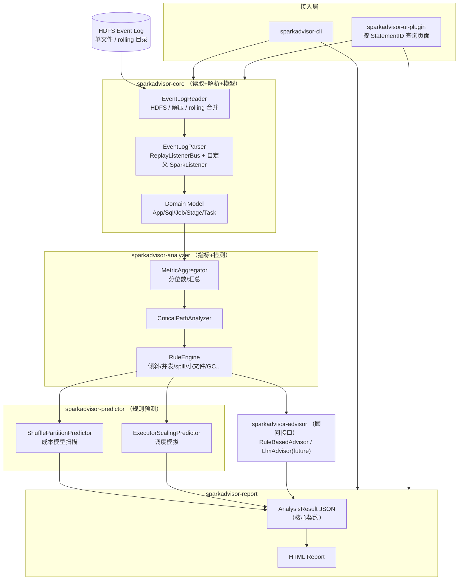
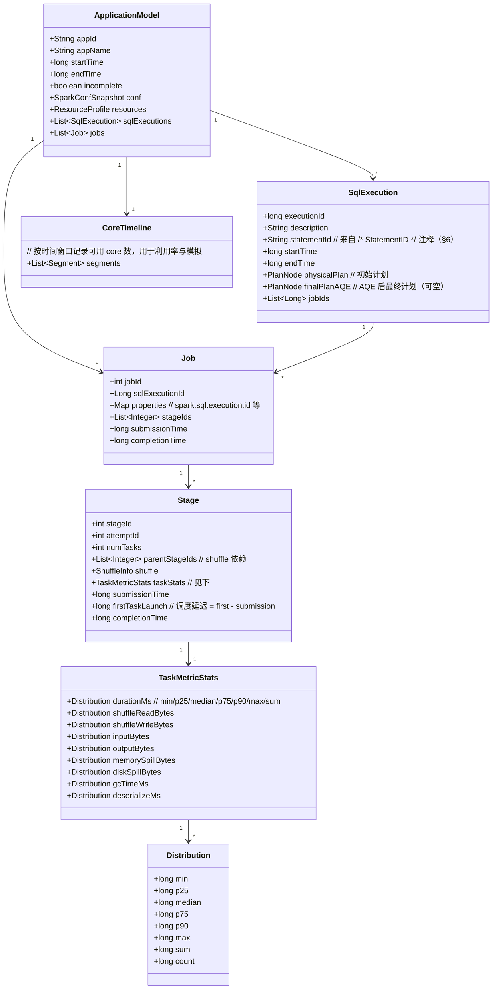
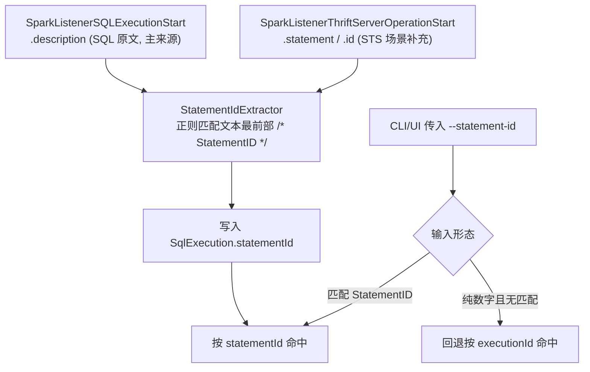
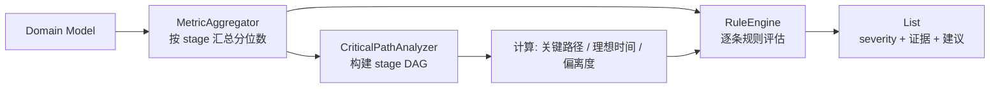
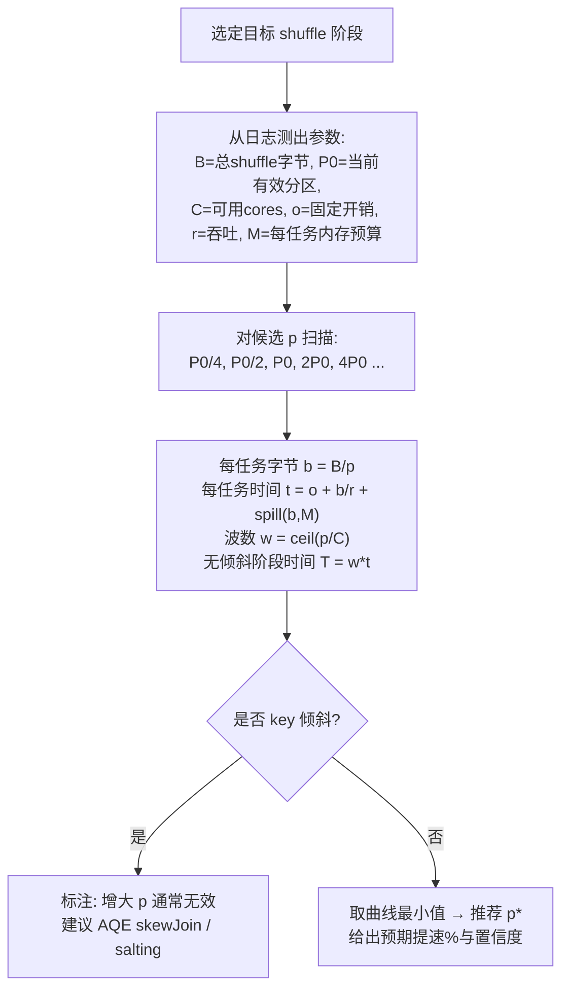
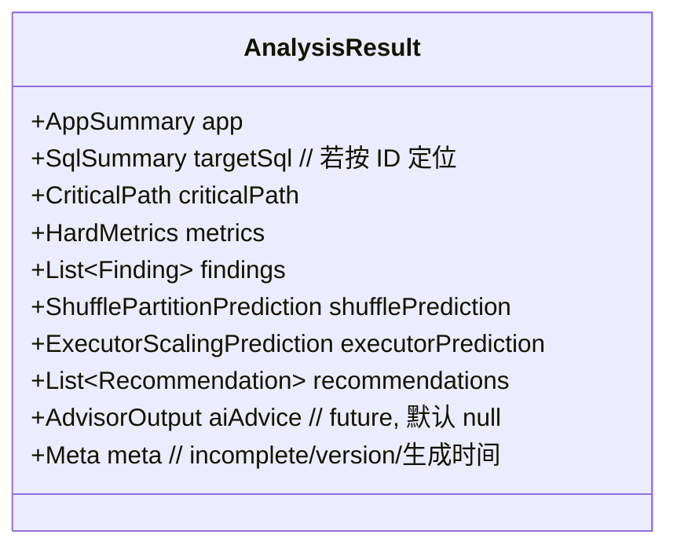
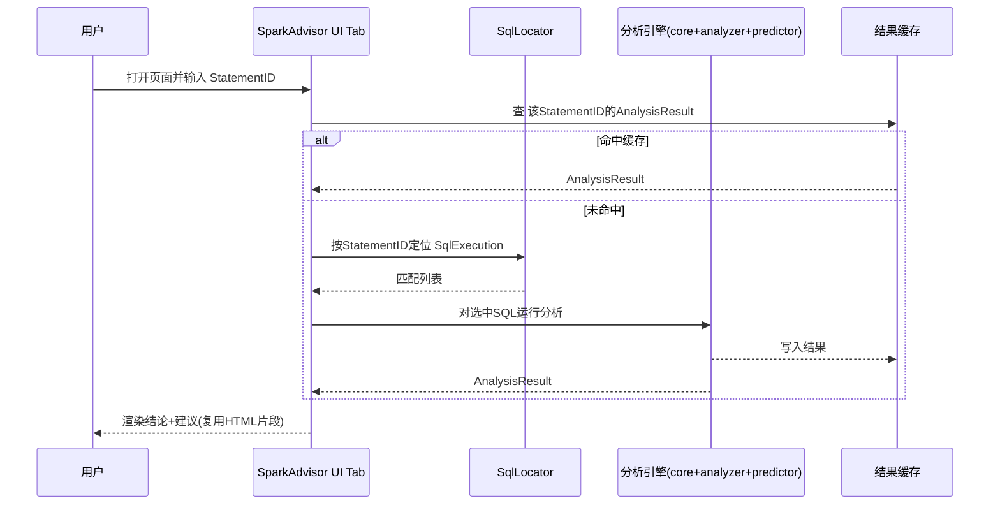
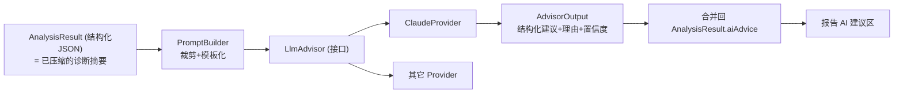

# SparkAdvisor — 设计文档

> 项目名称：**SparkAdvisor**（Spark Event Log 离线分析与调优顾问）

> 本文档面向 **Claude Code 等 Code Agent**，作为项目实现蓝图。
> 它定义架构、模块边界、领域模型、关键流程（mermaid）与核心算法，**不包含完整实现代码**。
> Code Agent 应据此分阶段实现；遇到与真实 Spark API 冲突处，以 Spark 3.5 实际签名为准。

---

## 1. 项目目标与范围

### 1.1 一句话定位

SparkAdvisor 是一个以 **Java 21** 为主实现的、面向 **Spark 3.5** 的 Event Log 离线分析与调优顾问：直接读取 HDFS 上归档的 event log，精确计算关键路径与硬指标，基于规则给出调优预测，输出 HTML/JSON 报告，并可作为 Spark UI 的一个轻量页面入口按 **StatementID** 查看结论。

### 1.2 功能需求映射

| 编号 | 需求 | 落地模块 | 阶段 |
| --- | --- | --- | --- |
| F1 | 读取/分析 HDFS event log，CLI 解析，输出结构化 HTML 报告 | `core` + `analyzer` + `report` + `cli` | M1 |
| F2 | 基于规则的性能预测与调优：关键路径、shuffle partition 预言、倾斜/并发不足/偏离度等硬指标 | `analyzer` + `predictor` | M1–M2 |
| F3 | 集成 Spark UI：按 StatementID 匹配 SQL，展示分析结论与调优建议 | `ui-plugin` | M2–M3 |
| F4 | 基于 AI 大模型的调优（先设计、暂不实现） | `advisor`（接口与契约） | 设计 only |

### 1.3 明确的范围约束（Non-Goals）

- **技术栈**：以 **Java 21** 为主语言（用其 records / sealed / pattern matching / virtual threads 等特性）。**不使用 Scala 编写**，但允许以 `provided` 方式依赖 Spark 的 Scala 产物（在 JVM 上从 Java 调用）。**必要时可使用 JS/HTML/CSS** 等前端技术栈（仅用于报告与 UI 页面的呈现，见 §9/§11）。
- **前端**：能力极简，优先后端。不引入前端工程化构建链（webpack/vite 等）；页面用服务端模板渲染的静态 HTML + 必要的原生 JS/CSS，图表可选 CDN 轻量库或内联 SVG。
- **不做**：实时流式监控、跨应用聚合大盘、成本（$）核算、写回集群执行优化。这些留给后续版本或交给现成工具（DataFlint 等）。
- **不重复造轮子**：JSON 反序列化复用 Spark `JsonProtocol`，不手写事件 schema（详见 §4）。

---

## 2. 总体架构



**分层原则**：`core`/`analyzer`/`predictor` 是纯计算库，无 IO 副作用之外的外部依赖；`cli` 与 `ui-plugin` 只是两个不同的“驱动外壳”，共享同一套引擎。`advisor` 是一个可插拔接口，当前只有规则实现，未来挂 LLM 实现（§11）。

---

## 3. 模块划分（Maven 多模块）

```
sparkadvisor/                       # 父 POM，统一依赖与版本，maven.compiler.release=21
├── sparkadvisor-core/              # 读取、解析、领域模型
├── sparkadvisor-analyzer/          # 指标聚合 + 关键路径 + 规则引擎
├── sparkadvisor-predictor/         # 规则预测（shuffle/executor 成本模型）
├── sparkadvisor-report/            # JSON/HTML 报告生成
├── sparkadvisor-advisor/           # 顾问接口 + 规则实现（LLM 预留）
├── sparkadvisor-cli/               # 命令行入口（picocli），产出离线报告
└── sparkadvisor-ui-plugin/         # Spark/History UI tab 集成
```

> **JDK 基线**：Java 21。父 POM 设 `maven.compiler.release=21`。鼓励用 `Record 类型` 表达领域模型与不可变结果对象、`sealed interface` 表达事件/Finding 类型、`switch` 模式匹配做事件分发、虚拟线程并行解析多个 event log 文件。Spark 3.5 官方支持在 Java 17/21 上运行，留意 Spark 对 JVM 的 `--add-opens` 启动参数要求（见 §10/§13）。

| 模块 | 关键依赖 | 依赖范围 | 说明 |
| --- | --- | --- | --- |
| core | `spark-core_2.12`, `spark-sql_2.12`, `hadoop-client`, `jackson` | provided（spark/hadoop）/ compile（jackson） | 复用 `JsonProtocol`/`ReplayListenerBus`；HDFS 用 Hadoop FileSystem |
| analyzer | core | compile | 无外部 IO |
| predictor | core, analyzer | compile | 纯算法 |
| report | analyzer, predictor, 模板引擎（Freemarker/Thymeleaf） | compile | 产出静态 HTML + JSON |
| advisor | report（消费 JSON）| compile | LLM provider 后续按需引入 HTTP 客户端 |
| cli | 全部 + `picocli` | compile | fat-jar |
| ui-plugin | core, analyzer, predictor, report, `spark-*`(provided) | provided | 打成插件 jar 放进 Spark classpath |

> **Scala 互操作注意**：`SparkListener`、`ReplayListenerBus`、`JsonProtocol`、SQL 事件类（`org.apache.spark.sql.execution.ui.*`）都是 Scala 编译产物但可在 JVM 上从 Java 调用。返回的是 Scala 集合/`Option`，Code Agent 应在 `core` 内封装一层 Java 友好的适配（用 `scala.collection.JavaConverters` 或手动转换），让上层模块只见 Java 类型。

---

## 4. 解析方案（关键技术决策）

### 4.1 决策：复用 Spark 的回放机制，不手写解析

Event log 是 JSON-lines（每行一个事件）。**不**自定义事件 POJO 逐字段解析，而是：

1. `EventLogReader` 打开 HDFS 上的日志，得到逐行 `InputStream`（处理解压与 rolling，见 §4.3）。
2. 构造一个 `org.apache.spark.scheduler.ReplayListenerBus`。
3. 注册一个**用 Java 实现的自定义 `SparkListener`**（`SparkEventCollector`），覆写 `onJobStart/onStageCompleted/onTaskEnd/...` 与 `onOtherEvent`（SQL 事件走这里）。
4. 调用 `replayBus.replay(stream, sourceName, ...)`，Spark 内部用 `JsonProtocol.sparkEventFromJson` 把每行还原成事件对象并分发给监听器。
5. 监听器把事件累积进领域模型（§5）。

**理由**：这是 `FsHistoryProvider` 重建 UI 的同款路径，Spark 自己保证了跨小版本的字段兼容；我们只负责“消费已还原的事件”，不背 schema 维护债。

> 备选方案（仅作 fallback 记录）：用 Jackson 定义最小事件 POJO 手解析。优点是零 Spark 依赖、可独立运行；缺点是要自己跟随版本演进。**默认不采用**，除非未来需要在没有 Spark jar 的环境独立运行。

### 4.2 需要消费的关键事件

| 事件 | 用途 |
| --- | --- |
| `SparkListenerEnvironmentUpdate` | 读取 `spark.*` 配置（shuffle.partitions、AQE 开关、executor 资源等） |
| `SparkListenerExecutorAdded/Removed` | 重建“可用并发槽位（cores）随时间变化”，用于利用率与模拟 |
| `SparkListenerSQLExecutionStart` | SQL 起点：`executionId`、物理计划（`sparkPlanInfo`）、`physicalPlanDescription`、`description` |
| `SparkListenerSQLAdaptiveExecutionUpdate` | **AQE 运行时计划变更**：最终计划/有效分区数可能与初始不同（关键，见 §9） |
| `SparkListenerSQLExecutionEnd` | SQL 终点与耗时 |
| `SparkListenerJobStart` | `properties` 中含 `spark.sql.execution.id`（关联 SQL）与用户自定义 ID（见 §6） |
| `SparkListenerJobEnd` | 作业耗时/结果 |
| `SparkListenerStageSubmitted/Completed` | stage 边界、`StageInfo`（含 RDD/shuffle 依赖、accumulables=SQL 指标） |
| `SparkListenerTaskEnd` | **核心**：`TaskMetrics`（运行时间、GC、shuffle read/write、input/output、内存/磁盘 spill、反序列化等） |

### 4.3 读取层细节（务必处理）

- **路径形态**：单文件 `application_xxx`（或 `.inprogress`）；rolling 形态是目录 `eventlog_v2_<appId>/`，内含多份 `events_N_<appId>` + `appstatus_<appId>` 标记，需按序拼接。
- **压缩**：`spark.eventLog.compress` 默认开启（snappy，也可能 lz4/zstd），按文件后缀/编解码器解压。
- **`.inprogress`**：作业未正常结束的日志会缺尾部事件（如 `JobEnd`/`SQLExecutionEnd`），解析器必须容忍“未闭合”的实体并在结果中标注 `incomplete=true`。
- **compaction 是有损的**：SHS 可能对 rolling 日志做过 compaction（丢弃部分历史事件），分析时要标注数据可能不完整。
- **大文件**：单条复杂 SQL 日志可达 GB 级，**必须流式逐行处理**，禁止整文件载入内存；领域模型只保留聚合所需的精简结构（见 §5 的内存策略）。
- **认证（Kerberos）**：**SparkAdvisor 自身不实现 Kerberos 登录逻辑**。约定 CLI 以 **root 用户**启动，启动前在同一 shell 环境执行固定的初始化命令完成 TGT 获取：

  ```bash
  source /opt/client/bigdata_env
  kinit -kt /opt/client/keytab/ossuser.keytab ossuser
  ```

  之后进程通过 `UserGroupInformation`（Hadoop 默认从 ticket cache 读取凭据）访问 HDFS，无需在代码里处理 keytab/principal。实现要点见 §10.1（CLI 的认证约定与封装脚本）。

---

## 5. 核心领域模型



**内存策略**：`Stage` 不保留每个 task 的原始记录，而是**在 `onTaskEnd` 时增量喂给一个分位数估计器**（如 t-digest 或固定桶直方图），最终得到 `Distribution`。这样即使百万级 task 也只占常数内存。原始 task 仅在 `--keep-raw` 调试模式下保留。

**Java 21 实现建议**：上述只读结果对象（`Distribution`、`SqlExecution`、`Finding`、各类 `Prediction`、`AnalysisResult` 等）用 `Record 类型` 表达，天然不可变且自带 equals/hashCode，便于缓存与 JSON 序列化；`Finding`/事件类别等封闭集合用 `sealed interface` + Record 类型 实现，配合 `switch` 模式匹配做分发。注意 Jackson 对 Record 类型的支持需 2.12+（Spark 3.5 自带版本已满足）。

---

## 6. SQL 关联与 StatementID 定位（F3 的基础）

每条 SQL 语句的**最前位置带有形如 `/* StatementID */` 的注释**（例如 `/* 20260521_abc123 */ select ...`）。SparkAdvisor 通过解析该注释中的 **StatementID** 把外部传入的 ID 映射到具体的 `SqlExecution`。这是 CLI 与 UI 共同的定位入口，StatementID 直接作为 CLI 参数（`--statement-id`，见 §10）。

### 6.1 StatementID 的来源与提取

**已确认**:SQL 原文落在以下两个事件字段(二者通常同时存在,后者更直接):

- `SparkListenerSQLExecutionStart.description` —— 携带 SQL 原文,头部含 `/* StatementID */`。
- `SparkListenerThriftServerOperationStart.statement` —— Thrift Server(STS)场景下的原始语句,同样含该注释;该事件还自带 `id`(operation id)与 `sessionId`,可作为更可靠的关联键。

`StatementIdExtractor` 的提取策略:

- 主来源 `SparkListenerSQLExecutionStart.description`;在 STS 场景下,用 `SparkListenerThriftServerOperationStart.statement` 作为补充/校验,并通过其 `executionId`/时间窗与 SQL execution 关联。
- 正则(可配置):`/\*\s*([A-Za-z0-9_\-]+)\s*\*/`,只取文本**最前部**的首个匹配,避免误取 SQL 体内的普通注释。
- 提取到的值写入 `SqlExecution.statementId`;取不到则置空,仍可按 `executionId` 定位。



> 注:`SparkListenerThriftServerOperationStart` 来自 `org.apache.spark.sql.hive.thriftserver` 包,仅在 STS 运行时产生且需对应 jar 在 classpath。解析器对该事件按"可选事件"处理——通过 `onOtherEvent` 用类名字符串匹配,缺失时不报错,只依赖 `SQLExecutionStart.description`。

### 6.2 定位服务

- **`SqlLocator`**：输入 StatementID（或 executionId）→ 输出匹配的 `SqlExecution` 列表。
- **一对多**：一个 StatementID 可能对应多个 SQL execution（同一语句被多次提交，或一条语句触发多个 action），定位结果返回**列表**并按耗时降序，CLI/UI 默认取最慢的一条并允许展开全部。
- **健壮性**：StatementID 比较 trim + 大小写敏感（ID 通常区分大小写）；提取失败不应导致整体解析失败，仅记录 warning。

---

## 7. 分析流程：硬指标与异常检测（F2 实测部分）



### 7.1 硬指标定义（均为**实测精确值**）

| 指标 | 定义 | 含义 |
| --- | --- | --- |
| 数据倾斜比 `skewRatio` | `task.duration.max / task.duration.median`（同理对 shuffleRead） | >5 视为显著倾斜 |
| 核心利用率 `coreUtil` | `Σ(task runtime) / (∫ availableCores dt)` | 低 → 槽位空转，并发不足或调度等待 |
| stage 并发度 | `numTasks vs 该时段 availableCores` | `numTasks < cores` → 欠并行 |
| 调度延迟 | `firstTaskLaunch - submissionTime` | 高 → 资源等待/动态分配冷启动 |
| spill 比 | `(memorySpill+diskSpill).sum / input.sum` | 高 → 内存不足或分区过大 |
| GC 占比 | `gcTime.sum / duration.sum` | >10% → GC 压力 |
| 偏离度 `deviation` | `(actualWallClock - criticalPath) / criticalPath` | 距“无限执行器下限”的距离 |

### 7.2 关键路径与理想时间

- **Stage DAG**：节点=stage，边=shuffle 依赖（父 shuffle-write → 子 shuffle-read），由 `StageInfo` 的 parent 关系重建。
- **单 stage 无限并行耗时** = `task.duration.max`（最长的那个 task，加再多 executor 也省不掉）。
- **关键路径** = DAG 中以“单 stage 无限并行耗时 + driver 间隙”为权重的最长路径。
- **理想时间（完美并行+零倾斜）** = 沿同一路径，每 stage 取 `task.duration.sum / availableCores`。
- 三者关系：`理想时间 ≤ 关键路径 ≤ 实际墙钟`。倾斜把单 stage 推向 `max`，并发不足把整体推离理想时间。报告用这三条线直观展示“可优化空间”。

### 7.3 规则目录（RuleEngine）

每条规则产出一个 `Finding{ id, category, severity(INFO/WARN/CRITICAL), targetStageId, evidenceMetrics, explanation, recommendations[] }`。`recommendation` 形如 `{ type: SQL_REWRITE | SPARK_CONF, action, rationale, expectedImpact }`。

| 规则 | 触发条件（示意阈值，可配） | 典型建议 |
| --- | --- | --- |
| R1 数据倾斜 | `skewRatio > 5` | 开/调 AQE skew join；salting；改 join key |
| R2 过度 spill | `spillRatio > 0.5` | 增大分区/内存；查倾斜 |
| R3 并发不足 | `numTasks < cores` 或 `coreUtil < 0.4` | 增大 shuffle.partitions / repartition |
| R4 过度并行（小任务） | `median < 200ms` 且 `numTasks` 巨大 | 减少分区 / coalesce |
| R5 小文件 | input stage 任务多且单 task input 极小 | 合并小文件 / 调 `maxPartitionBytes` |
| R6 GC 压力 | `gcRatio > 0.1` | 调内存/堆/序列化 |
| R7 Broadcast 问题 | 计划回退 SMJ / broadcast 超阈 | 调 `autoBroadcastJoinThreshold` |
| R8 调度等待 | 调度延迟占比高 | 动态分配/资源预热 |

---

## 8. 规则预测引擎（F2 预测部分）

> **诚实声明**：以下是**基于成本模型的估计**，非保证值。输出必须携带：所用假设、置信度（HIGH/MEDIUM/LOW）、以及“在什么条件下结论会反转”的提示。硬指标（§7.1）才是精确实测值。

### 8.1 Shuffle Partition 预言

回答“调大/调小 `shuffle.partitions` 会更快还是更慢”。



成本模型核心式（写进 `predictor`）：
- 每任务字节 `b(p) = B / p`
- 每任务时间 `t(p) = o + b(p)/r + spillPenalty(b(p), M)`，其中 `spillPenalty>0` 仅当 `b(p) > M`
- 波数 `w(p) = ceil(p / C)`
- 阶段时间 `T(p) = w(p) · t(p)`
- 参数 `o, r` 由当前 run 的 `(bytes, time)` 任务样本拟合（或用中位数估算）

**结论形态**：当前 `p=P0` 估计 `T(P0)`；推荐 `p*` 估计 `T(p*)`；并解释驱动方向——当 `numTasks<C`（欠并行）时调大变快；当 `median` 已极小（过并行）时调大变慢。

### 8.2 AQE 交互（必须处理，否则预测错误）

- Spark 3.5 默认 `spark.sql.adaptive.enabled=true`：运行时会按 `advisoryPartitionSizeInBytes` **自动合并**分区。因此“有效分区数”应从 `SparkListenerSQLAdaptiveExecutionUpdate`/最终计划读取，**而非** `spark.sql.shuffle.partitions` 配置值。
- 当 AQE 合并开启时，真正的旋钮是 `advisoryPartitionSizeInBytes` 与 `coalescePartitions.initialPartitionNum`；预测与建议应针对这些参数，并提示“`shuffle.partitions` 仅决定初始上界”。
- 倾斜规则也要先看 `spark.sql.adaptive.skewJoin.enabled` 是否已开；若已开仍倾斜，则建议调 `skewJoin.skewedPartitionFactor`/阈值，而非简单“开 AQE”。

### 8.3 Executor 伸缩预言（Sparklens 式）

- 用 §7.2 的 stage DAG + 每 stage 总 task 时间，做一个**贪心离散调度模拟**：给定 N 个 core，按依赖顺序把 task 填入空闲槽位，得到估计墙钟与利用率。
- 对一组候选执行器数（如 当前的 25%/50%/100%/150%/200%）各跑一次模拟，输出“加 executor 的边际收益”曲线，识别收益拐点。

---

## 9. 报告设计（F1 输出）

### 9.1 双产物：JSON（契约） + HTML（人读）

`AnalysisResult`（JSON）是**全系统的统一契约**：CLI、UI、未来的 LLM 顾问都消费它。HTML 只是它的一种渲染。



### 9.2 HTML 报告章节

应用概览 → 目标 SQL 概览（计划/耗时/stage 列表）→ 关键路径图（理想/关键路径/实际三线）→ 硬指标面板（倾斜/利用率/偏离度/spill/GC）→ Findings（按 severity 排序）→ 预测（shuffle 曲线、executor 曲线）→ 调优建议（SQL + 配置项分组）→ AI 建议占位区（F4）。

**实现约束（前端从简）**：服务端模板（Freemarker/Thymeleaf）生成单文件 HTML；图表用内联 SVG 或单个 CDN 轻量库（如 ECharts），数据以 JSON 内联进页面，**不引入构建工具/打包流程**。

---

## 10. CLI 设计（F1 驱动外壳）

picocli 实现，fat-jar 运行，目标 JDK 21。

```
java -jar sparkadvisor-cli.jar analyze \
  --path hdfs:///spark-logs/application_1700000000000_0001 \
  --statement-id <StatementID>             # 可选；按 /* StatementID */ 注释定位
                                            # 也接受纯数字 executionId 作回退
  --format html|json                        # 默认 html
  --out  ./report.html \
  --top  5                                  # 不指定 statement-id 时分析最慢的 N 条
  --keep-raw                                # 调试：保留原始 task
```

子命令建议：`analyze`（出报告）、`locate`（仅列出某 StatementID 命中的 SQL 摘要）、`metrics`（仅打印硬指标 JSON，便于脚本化）。

### 10.1 Kerberos 认证约定（运维侧固定命令）

SparkAdvisor **不在代码内做 Kerberos 登录**。CLI 以 **root 用户**启动，依赖启动前在同一 shell 完成的票据初始化。提供一个封装启动脚本 `bin/sparkadvisor`，固定执行以下序列：

```bash
#!/usr/bin/env bash
set -euo pipefail
# 1) 加载集群环境变量（HADOOP_CONF_DIR / krb5.conf 等）
source /opt/client/bigdata_env
# 2) 用固定 keytab 获取 TGT（票据进入 ticket cache）
kinit -kt /opt/client/keytab/ossuser.keytab ossuser
# 3) 启动 CLI（Spark 3.5 在 JDK 21 上需放开模块封装）
exec java \
  --add-opens=java.base/java.lang=ALL-UNNAMED \
  --add-opens=java.base/java.nio=ALL-UNNAMED \
  --add-opens=java.base/sun.nio.ch=ALL-UNNAMED \
  --add-opens=java.base/java.util=ALL-UNNAMED \
  -jar "$(dirname "$0")/../lib/sparkadvisor-cli.jar" "$@"
```

实现要点：

- 代码侧只需正常使用 Hadoop `FileSystem`/`UserGroupInformation`，后者会自动从 `kinit` 写入的 ticket cache 读取凭据，**无需**在 CLI 暴露 keytab/principal 参数。
- `HADOOP_CONF_DIR` 由 `source /opt/client/bigdata_env` 设置，`core-site.xml`/`hdfs-site.xml` 随之生效；如脚本未导出，允许通过 `--hadoop-conf-dir` 兜底指定。
- `--add-opens` 是 Spark 3.5 在 JDK 17/21 上回放/反射访问内部类所必需的；缺失会在解析阶段抛 `InaccessibleObjectException`（见 §13）。
- 票据过期：长任务可在脚本里加 `kinit -R` 续期或重跑 `kinit`；CLI 属于短时离线分析，一般单次票据足够。

---

## 11. Spark UI 集成（F3）



### 11.1 集成路径与分期（重要）

在 Spark UI 挂自定义 tab 用的是 **Spark 内部/开发者 API**（`SparkUI.attachTab` + `WebUITab`/`WebUIPage`，多为 `private[spark]`），跨版本有破坏风险。按复杂度分期：

- **阶段一（最简，已规划于 M1/M2）**：不碰 Spark UI。CLI 产出 HTML + 一个**独立的轻量内嵌 HTTP 服务**（如 Spark 自带的 Jetty 或独立 `com.sun.net.httpserver`，可配合 JDK 21 虚拟线程承接请求），按 StatementID 提供 `/analysis?statementId=xxx` 页面。完全满足“按 StatementID 看结论”的诉求，且零侵入。
- **History Server tab（M3，目标接入方式）**：在常驻的 History Server 进程内挂 tab，服务**已结束、日志已归档**的应用——这正是本项目的核心场景。需对接 SHS 的 UI 扩展机制与 KVStore，DataFlint 即走此路；最重，固定 Spark 小版本以控风险。

> **运行中应用也走 History Server（队列监控场景）**：History Server 默认会列出"运行中/未完成"的应用（读 `.inprogress` 日志，标为 incomplete，按 `spark.history.fs.update.interval` 间歇刷新）。因此对长驻查询队列的实时性要求不高的监控，可**直接用 SHS tab 读运行中 app 的 `.inprogress`，零侵入、不碰生产 Driver**。这是队列分析（见独立文档 `SparkAdvisor-monitor-design.md`）的 UI 入口，与 M3 的 tab 复用同一套 `AppHistoryServerPlugin`。详见该文档。

> **关于 live driver tab（已决定不单独实现）**：live driver tab 挂在运行中应用的 driver UI（4040 端口）上，仅在应用运行期间可见，应用一结束即随 driver 消失，数据来自 driver 内存。它服务的是“运行中应用的实时观测”，**不覆盖本项目的事后归档分析场景**，且其 UI 接入代码与 SHS tab 不能直接复用。因此跳过它：阶段一的轻量内嵌服务已满足过渡期需求，直接推进到 M3 的 SHS tab。**例外**：若存在长驻 Spark Thrift Server 且需运行时实时查看分析，再补 live tab——届时把 UI 接入层抽象成「analysis→HTML 片段」渲染核心 + live/SHS 两个薄适配器以复用代码。

> 给 Code Agent 的提醒：SHS tab 涉及的 UI 类是非稳定 API，实现时务必针对 Spark 3.5.1 验证签名，并把 UI 接入与分析引擎严格解耦——引擎产出 `AnalysisResult`，UI 只负责渲染，便于未来换接入方式。

---

## 12. AI 大模型调优能力设计（F4，先设计不实现）



设计要点（实现留待后续）：

- **顾问抽象**：`interface TuningAdvisor { AdvisorOutput advise(AnalysisResult r); }`。当前注入 `RuleBasedAdvisor`（已有规则建议）；未来加 `LlmAdvisor`。两者输出同一 `AdvisorOutput` 结构，报告无需区分来源。
- **喂给模型的是结构化摘要，不是原始日志**：这是全程的核心原则——`AnalysisResult` 已把 GB 日志压成 KB 级硬指标、关键路径、findings 与预测。Prompt 只携带它（必要时再裁剪 token），**绝不**把 raw event log 灌给模型。
- **数据契约稳定**：因为 LLM 消费的是 §9.1 的同一 JSON，规则版与 LLM 版可平滑切换/并存（如规则给硬建议、LLM 给叙述性根因与组合调参方案）。
- **Provider 可插拔**：HTTP 客户端、鉴权、超时、重试在 provider 内封装；支持本地/云端模型；输出需可被解析为 `AdvisorOutput`（要求模型返回约定 JSON）。
- **安全/合规**：可配置脱敏（表名/路径打码）后再外发；支持“仅本地模型”开关。

---

## 13. 关键技术难点与注意事项（给 Code Agent 的清单）

1. **Scala 互操作**：在 `core` 内统一把 Scala `Option`/集合转 Java 类型，上层不感知 Scala。
2. **JDK 21 运行 Spark**：Spark 3.5 在 Java 17/21 上回放/反射需要启动加 `--add-opens`（见 §10.1）。封装在 `bin/sparkadvisor` 脚本里；缺失会抛 `InaccessibleObjectException`。同时确认所用 Spark/Hadoop 依赖版本对 JDK 21 兼容。
3. **StatementID 提取**：SQL 原文字段不固定，按 `description→details→physicalPlanDescription` 顺序尝试，正则只认文本最前部的 `/* ... */`；准备“带注释/不带/注释在中部”单测。
4. **流式与内存**：百万级 task 必须增量分位数（t-digest/直方图），禁止全量驻留。
5. **AQE**：有效分区数/最终计划来自运行时事件，不要用静态配置反推（§8.2）。
6. **`.inprogress` 与 compaction**：容忍不完整数据并在 `meta` 标注，下游展示需提示置信度下降。
7. **rolling 日志**：识别 `eventlog_v2_*` 目录形态，按序合并多文件。
8. **版本耦合**：UI 接入类是非稳定 API，固定/校验 Spark 3.5 签名；解析层因复用 `JsonProtocol` 风险较低，但仍写**回归测试**：准备若干真实 event log 黄金样本，断言关键指标稳定。
9. **预测的诚实性**：所有预测带假设与置信度；倾斜场景明确告知“调分区无效”。
10. **解耦**：引擎 → `AnalysisResult` → 渲染/接入。任何新接入方式（新 UI、API、LLM）都只消费这个契约。

---

## 14. 分阶段实施路线（建议里程碑）

| 里程碑 | 交付 | 验收标准 |
| --- | --- | --- |
| M1 | core 解析 + analyzer 硬指标 + 关键路径 + CLI 出 HTML/JSON + 轻量内嵌服务按 StatementID 查看 | 对黄金样本日志，倾斜比/利用率/偏离度与人工核算一致；按 StatementID 能定位并出报告 |
| M2 | predictor（shuffle 预言 + executor 伸缩）+ 规则建议完善 + live driver tab | 预测输出带假设/置信度；倾斜场景给出正确“无效”提示；driver tab 可按 StatementID 展示 |
| M3 | History Server tab（可选）+ advisor 接口接入 LLM 实现 | LLM 仅消费 AnalysisResult；规则版与 LLM 版可切换 |

---

## 15. 附录：建议的项目骨架

```
sparkadvisor/
├── pom.xml                  # release=21
├── bin/sparkadvisor         # 启动脚本：source bigdata_env + kinit + java --add-opens
├── sparkadvisor-core/       src/main/java/.../core/{io,parse,model,locate}   # locate=StatementIdExtractor/SqlLocator
├── sparkadvisor-analyzer/   src/main/java/.../analyzer/{metric,criticalpath,rule}
├── sparkadvisor-predictor/  src/main/java/.../predictor/{shuffle,executor,costmodel}
├── sparkadvisor-report/     src/main/java/.../report/{json,html,template}
├── sparkadvisor-advisor/    src/main/java/.../advisor/{api,rule,llm(future)}
├── sparkadvisor-cli/        src/main/java/.../cli
├── sparkadvisor-ui-plugin/  src/main/java/.../ui/{plugin,tab,page,server}
└── testdata/                黄金样本 event log（单文件/rolling/inprogress/AQE/带StatementID注释 各一）
```
