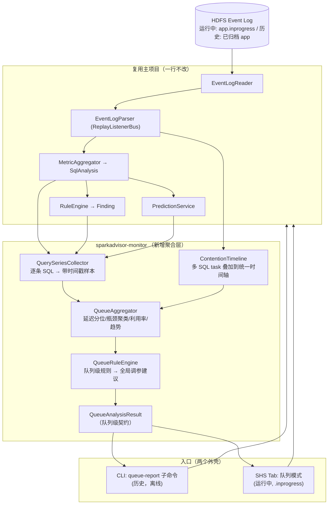
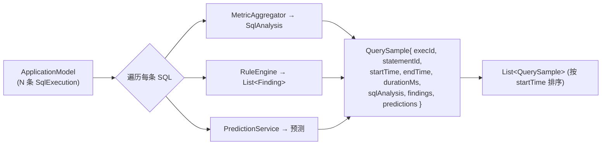
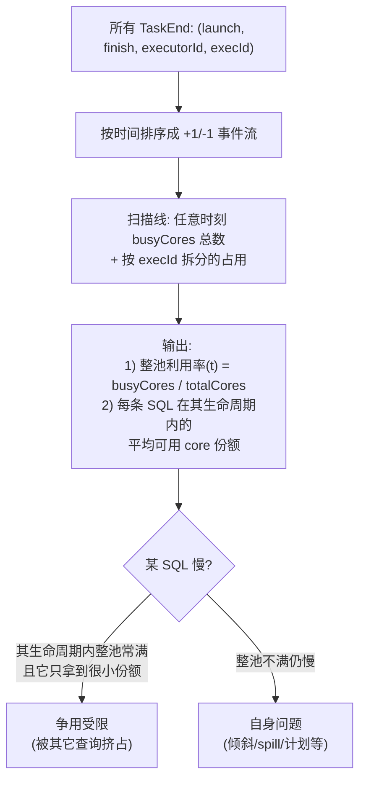
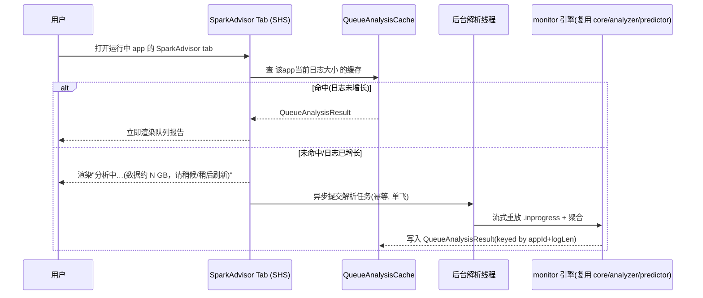
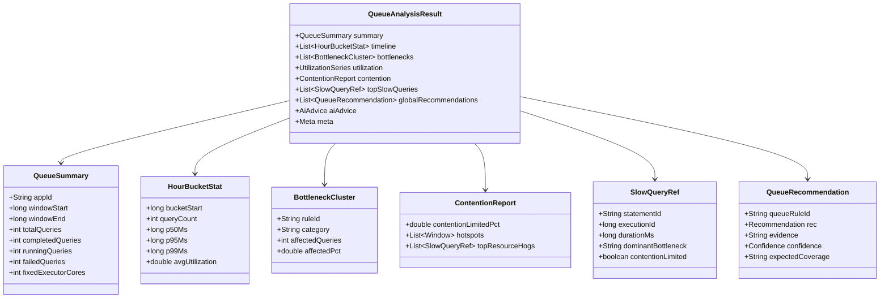

# SparkAdvisor Monitor — 查询队列分析层设计文档

> 本文档面向 **Claude Code 等 Code Agent**，作为 `sparkadvisor-monitor` 模块的实现蓝图。
> 它是主项目（见 `SparkAdvisor-design.md` 与仓库 `CLAUDE.md`）的**上层延伸**：把"单条 SQL 事后诊断"扩展为"长驻查询队列的跨 SQL 聚合分析"。
> 约定与主项目一致：生产产物兼容 Java 8（JDK 21 编译）、Spark 3.5.1、Spark/Hadoop 为 `provided`、复用 `core/analyzer/predictor/report` 全部能力、不手写事件 schema、Spark 内部 API 标 `// VERIFY@3.5.1`。

---

## 1. 背景与目标

### 1.1 场景

存在一个**长期运行的共享查询队列**（一个长驻 Spark Application，如 `Carbon_Query_SDR`）：

- 1 个 Driver + **固定数量** Executor（不依赖动态分配）。
- 每天凌晨 **01:52 自动重启**（防止长时间运行内存碎片）。每轮运行期间执行成百上千条 SQL。
- 已开启 `spark.eventLog.enabled=true`，日志归档到 HDFS；一轮（约 22 小时）event log 约 **10 GB**。

### 1.2 目标

分析**一整轮运行（约 02:00–24:00）所有 SQL 的执行情况**，识别**队列级**性能瓶颈，给出**全局** Spark 调参建议（而非单条 SQL 的建议）。

### 1.3 两个入口（同一引擎，不同外壳）

| 入口 | 用途 | 数据 | 实时性 |
| --- | --- | --- | --- |
| **History Server tab（页面）** | 分析**当前正在运行**的查询队列 | 运行中 app 的 `.inprogress` 日志 | 不高（SHS 按 `update.interval` 间歇刷新，秒级到分钟级） |
| **CLI 子命令（后台）** | 分析**历史**已结束的查询队列 | 已归档的完整 app 日志 | 离线批处理 |

两者复用同一个 `QueueAnalyzer` 聚合引擎，符合主项目"引擎 → 结果契约 → 多种驱动外壳"的分层。

### 1.4 与单 SQL 分析的本质区别（为什么需要新模块）

1. **资源固定且共享**：executor 数固定、不能加。问题从"加 executor 能否更快"变成"**这池固定资源被所有 SQL 怎么瓜分**"。
2. **看分布与趋势，非单点**：单条慢 SQL 不重要；重要的是哪类瓶颈**反复出现**、延迟分位数随时间如何变化、是否存在大查询挤占小查询。
3. **全局参数的矛盾**：同一个 `spark.sql.shuffle.partitions` 可能对大查询好、对小查询是灾难。固定队列里这种矛盾最突出，是调参建议的核心依据。

---

## 2. 关键约束与设计取舍（务必遵守）

| 约束（来自用户） | 设计影响 |
| --- | --- |
| fat jar 放 Spark 目录即用，最多一个开关参数 | 复用现有 CLI fat jar + 现有 ui-plugin（ServiceLoader）。不新增部署物，不改 Spark 启动脚本 |
| **不做嵌入式修改、不影响 Spark 正常执行** | **禁止**把任何 listener/plugin 注册进生产查询队列的 Driver。只读 HDFS 日志，旁路分析 |
| 实时性要求不高 | 不需要常驻监控进程、不需要增量追读的实时管线。SHS 间歇刷新 + 一次性批处理即可 |
| 01:52 重启 = 天然边界 | 每轮 = 一个完整 app 日志。**无需跨 app 拼接**。历史分析针对单个归档 app；运行中分析针对当前 `.inprogress` app |
| 页面分析运行中、后台分析历史 | 页面入口读 `.inprogress`（容忍不完整）；CLI 入口读完整归档日志 |

> **路 2 决策记录**：页面 tab 挂在 **History Server**（读运行中 app 的 `.inprogress`），**不**挂运行中 Driver 的 4040 UI。理由：零侵入、不碰生产 Driver、真正复用 M3 的 `AppHistoryServerPlugin`；代价是非秒级实时（用户已接受）。详见主设计文档 §11.1。

---

## 3. 总体架构



**核心思想**：把一个 app 的 event log 完整重放一遍，期间每遇到一条**结束的 SQL** 就跑现有引擎得到 `SqlAnalysis`+findings+预测，连同时间戳收集起来；同时在重放过程中把所有 task 投影到一条统一时间轴用于争用分析；最后做跨 SQL 聚合，产出队列级结果与全局建议。

---

## 4. 模块与依赖

```
sparkadvisor-monitor   queue 聚合分析       → core, analyzer, predictor, report
```

新增模块 `sparkadvisor-monitor`，依赖方向单向向下，依赖 `core`（解析/聚合/争用时间轴）、`analyzer`（findings）、`predictor`（预测）、`report`（复用 `AnalysisResult` 渲染单条 SQL 详情）。

- **CLI 入口**：在现有 `sparkadvisor-cli` 加 `queue-report` 子命令，依赖 `monitor`。
- **Tab 入口**：在现有 `sparkadvisor-ui-plugin` 的 `SparkAdvisorPage` 加"队列模式"，依赖 `monitor`。
- Spark/Hadoop 仍 `provided`。

---

## 5. 单遍重放：从一个 app 日志收集所有 SQL

### 5.1 复用 + 扩展 collector

主项目的 `SparkEventCollector` 把**整个 app** 聚合成一个 `ApplicationModel`（含全部 SqlExecution/Job/Stage）。队列分析**不需要改它**：重放得到 `ApplicationModel` 后，对其中每个 `SqlExecution` 跑 `MetricAggregator.analyze()` + `RuleEngine` + `PredictionService`，即得每条 SQL 的完整分析。



### 5.2 10 GB 日志的性能策略（必须实现）

10 GB / 几百条 SQL 完全可解析，但**点 tab 不能让用户干等、不能 OOM**：

1. **流式逐行**：`ReplayListenerBus` 本就逐行；领域模型只保留聚合所需结构（增量分位数），**禁止**全量 task 驻留。沿用主项目内存策略。
2. **深度分析仅 top-N**：对**全部** SQL 做轻量聚合统计（耗时、stage 数、shuffle/spill 汇总）；只对**最慢的 top-N**（默认 50，可配）跑完整 findings+预测+关键路径。其余只进分布统计。这把重活限制在常数规模。
3. **异步 + 缓存（仅 Tab 入口）**：见 §9。CLI 入口是离线批处理，可同步全量。

---

## 6. 资源争用时间轴（本模块核心技术点）

固定 executor 池下，最有价值也最难的分析：**任意时刻这池 core 被谁占用？某条 SQL 慢是自身问题还是被其它大查询挤占？**

### 6.1 算法

每个 `TaskEnd` 事件带 `launchTime`、`finishTime`、`executorId`，且能关联到所属 stage→job→SQL execution。把所有 task 投影成时间区间事件，扫描线积分：



复用主项目 `core/analyze/CoreTimeline` 的"按时间积分 core"骨架，**扩展为按 execution 归因**：新增 `ContentionTimeline`，除总占用外，记录每个时间片各 execution 占用的 core 数。

### 6.2 关键产物

- **整池利用率时间序列** `utilization(hourBucket)`：判断队列是长期跑满（资源不足）、大量空闲（并行度/调度问题），还是周期性被少数大查询占满（需隔离/限流）。
- **每条 SQL 的"争用受限度"**：其生命周期内 `平均整池占用率` 与 `自身获得的 core 份额`。据此把慢查询分成"自身瓶颈"和"争用受限"两类——**这决定调参方向完全不同**（前者调 SQL/计划，后者调并发控制/资源隔离）。
- **争用热点时段**：利用率持续 100% 且排队明显的时间窗。

> 诚实声明：event log 不直接记录"排队等待"，争用受限是**基于占用率的推断**。当 `spark.scheduler.mode=FAIR` 或有多 pool 时，归因更复杂；文档实现先做 FIFO/单池假设，结果标注置信度。

---

## 7. 队列级聚合（QueueAggregator）

输入 `List<QuerySample>` + `ContentionTimeline`，产出队列级指标：

| 维度 | 内容 |
| --- | --- |
| **吞吐与延迟** | 总查询数、成功/失败数、每小时查询数；耗时 **P50/P95/P99**、最大值；按小时分桶的延迟趋势曲线 |
| **瓶颈聚类** | 把所有 SQL 的 findings 按 `ruleId` 归并计数：例如"63% 的慢查询命中 R2_EXCESSIVE_SPILL"。**反复出现的同一瓶颈**才是全局调参的依据 |
| **资源利用** | 整池利用率时间序列、峰值/均值；executor 内存/GC 的聚合分布 |
| **争用** | 争用受限查询占比、争用热点时段、Top 占用查询（"资源大户"） |
| **慢查询榜** | Top-N 最慢 SQL（带 StatementID，可下钻到单 SQL 的 `AnalysisResult` 详情页/报告） |
| **参数矛盾检测** | 同一固定参数下，"大查询欠并行" 与 "小查询过并行" 是否同时大量出现 → 静态值不合适的强信号 |

### 7.1 时间分桶

按小时（可配）分桶，覆盖 02:00–24:00。每桶统计查询数、延迟分位、利用率，形成趋势序列。运行中分析（`.inprogress`）则覆盖 02:00 至当前时刻。

---

## 8. 队列级规则与全局调参建议（QueueRuleEngine）

与单 SQL 的 `RuleEngine` 分开：单 SQL 规则看一条 SQL 的一个 stage；**队列规则看跨 SQL 的统计证据**，产出**带统计支撑的全局建议**。同样 **AQE 感知**（复用 `AqeContext`）。

| 队列规则 | 触发条件（基于聚合统计） | 全局建议示例 |
| --- | --- | --- |
| Q1 普遍 spill | ≥X% 慢查询命中 R2，且 executor 内存利用率峰值仍偏低 | 调大 `spark.executor.memory`；预计覆盖这批查询 |
| Q2 普遍倾斜 | ≥X% 慢查询命中 R1 | 确认 `spark.sql.adaptive.skewJoin.enabled`，调 `skewedPartitionFactor` |
| Q3 静态分区不当 | 大查询欠并行 与 小查询过并行 并存 | 强烈建议开/调 AQE（`advisoryPartitionSizeInBytes`），让分区自适应而非固定 `shuffle.partitions` |
| Q4 资源不足 | 整池利用率长期接近 100% + 大量争用受限查询 | 增加 executor 数/core；或对大查询限流/隔离 |
| Q5 资源闲置 | 整池利用率长期偏低 + 查询仍慢 | 瓶颈不在资源量，转向 SQL/计划优化；考虑减小 executor 浪费 |
| Q6 普遍小文件 | ≥X% 扫描 stage 命中 R5 | 推动上游 compaction；调 `spark.sql.files.maxPartitionBytes` |
| Q7 普遍 GC | ≥X% 慢查询命中 R6 | 调内存/GC 收集器；审查重对象 UDF |

每条队列建议必须携带：**证据**（命中比例、样本数、相关分位值）+ **置信度** + **预期覆盖范围**（"预计影响过去 22h 的 N% 慢查询"）。阈值集中到 `QueueRuleThresholds`（与单 SQL 的 `RuleThresholds` 分开）。

---

## 9. 入口一：History Server Tab（运行中队列）

### 9.1 复用 M3 tab，新增"队列模式"

主项目 M3 的 `SparkAdvisorPage` 已能按 StatementID 出单条 SQL 报告。这里**同一个 tab** 增加一个队列模式：进入某 app 的 SparkAdvisor tab 时，默认展示**该 app 的队列级报告**（`QueueAnalysisResult` 渲染）；仍保留 StatementID 输入框用于下钻单条 SQL。



### 9.2 运行中 `.inprogress` 的处理（关键）

- **SHS 默认就列出运行中 app**（incomplete），按 `spark.history.fs.update.interval`（默认 10s）依据**文件大小变化**间歇刷新。我们读到的就是当时的 `.inprogress` 快照。
- **容忍不完整**：尾部可能截断、最后若干 SQL 未闭合（无 `SQLExecutionEnd`）。聚合层把"未结束的 SQL"单列为"运行中"，**不混入**已完成统计；`QueueAnalysisResult.meta` 标 `runningSnapshot=true` 和快照时间。
- **缓存键 = appId + 已读日志字节数**：与 FsHistoryProvider 同思路（按文件大小判断是否变化）。日志没增长就直接返回缓存，避免重复解析 10 GB。
- **异步单飞**：同一 app 的解析任务全局只跑一个，避免多用户点击触发并发重放打爆 SHS。**绝不**在 SHS 的 UI 请求线程里同步解析 10 GB（会卡死页面、可能 OOM）。
- **资源隔离**：解析线程池大小受限、内存有上界；解析失败/超时降级为友好提示，**绝不影响 SHS 对其它 app 的服务**。

### 9.3 SHS 端建议配置（写入 DEPLOY 文档，不强制）

- 适当增大 SHS 堆（解析 10 GB 需要余量）。
- `spark.eventLog.rolling.enabled=true` + `maxFileSize`：让长驻队列的日志滚动成多文件，便于增量与控制单文件大小（**注意** compaction 是有损的，会丢弃部分历史事件，需权衡）。
- `spark.history.fs.update.interval` 视实时性需求设定。

---

## 10. 入口二：CLI 子命令（历史队列，离线）

在 `sparkadvisor-cli` 新增 `queue-report` 子命令（与现有 `analyze` 并列）：

```
java -jar sparkadvisor-cli.jar queue-report \
  --path hdfs:///spark2x/eventLog/<已结束的 Carbon_Query_SDR app 日志> \
  --format html|json \
  --out ./queue-report.html \
  --top 50 \              # 深度分析的最慢 SQL 数（其余只进聚合）
  --bucket 1h             # 时间分桶粒度
# Kerberos 由 bin/sparkadvisor 启动脚本的固定 kinit 处理（与主项目一致）
```

- 离线批处理，可同步全量解析（无 UI 线程阻塞顾虑）。
- 典型用法：每天重启后，对上一轮归档日志跑一次，产出"昨日队列健康报告"。
- 复用 `bin/sparkadvisor` 启动脚本（含 `source bigdata_env` + `kinit`；JDK 9+ 运行时条件添加 `--add-opens`）。

---

## 11. 结果契约：QueueAnalysisResult

队列级统一契约（纯 Java value type，无 Spark 类型，可 JSON 序列化；与单 SQL 的 `AnalysisResult` 平级）：



- 复用 `core/finding/Recommendation`、`core/predict/Confidence`、`report` 的 `AiAdvice`。
- `SlowQueryRef` 携带 StatementID，HTML 报告中可链接/下钻到该 SQL 的单条 `AnalysisResult` 详情（复用 `HtmlReportWriter.renderBody`）。
- **F4 顾问可直接复用**：把 `QueueAnalysisResult` JSON 喂给 LLM（仍是结构化摘要，非 raw log），产出队列级 AI 调参建议——`PromptBuilder` 增加一个队列 prompt 变体即可。

---

## 12. HTML 报告结构（队列视图）

复用 `report` 的样式与渲染基建；新增队列版面：

队列概览（app/窗口/查询数/固定 core）→ 延迟趋势（按小时 P50/P95/P99 折线，内联 SVG）→ 整池利用率时间序列 → 瓶颈聚类（按规则占比的柱状/排行）→ 争用报告（争用受限占比、热点时段、资源大户）→ 慢查询 Top-N（可下钻单 SQL）→ **全局调参建议**（带证据/置信度/预期覆盖）→ AI 队列建议占位（F4）→ 内嵌 JSON 契约。

运行中快照在页头显著标注 `运行中快照 @ HH:MM，含 K 条未完成查询`。

---

## 13. 关键技术难点清单（给 Code Agent）

1. **10 GB 不阻塞、不 OOM**：流式重放 + 仅 top-N 深度分析 + Tab 入口异步单飞 + 按"appId+日志字节数"缓存。CLI 入口可同步。
2. **`.inprogress` 容错**：未闭合 SQL 单列为运行中，不混入完成统计；`meta` 标快照与不完整。
3. **争用归因**：`ContentionTimeline` 扫描线积分，按 execution 拆分占用；FIFO/单池假设先行，FAIR/多池标降级置信度。event log 无显式排队，争用是占用率推断，需诚实标注。
4. **rolling + compaction**：长驻队列可能开滚动日志；compaction 有损（丢事件），分析结果需标注可能不完整。`EventLogReader` 已处理 rolling 目录形态，复用。
5. **队列规则的统计阈值**：基于"命中比例 + 样本数"，避免被极少数离群 SQL 带偏；阈值集中到 `QueueRuleThresholds`。
6. **下钻一致性**：慢查询详情必须与单 SQL 入口产出完全一致（同一 `MetricAggregator`/`RuleEngine`），保证页面与 CLI 结论不矛盾。
7. **解耦**：`monitor` 引擎产出 `QueueAnalysisResult`，CLI/Tab 只是渲染外壳；Spark UI 接入沿用 M3 的 VERIFY@3.5.1 约定。

---

## 14. 分阶段实施

| 里程碑 | 交付 | 验收 |
| --- | --- | --- |
| Q-M1 | `monitor` 核心：单遍重放收集 `QuerySample` + `QueueAggregator`（延迟分位/瓶颈聚类/趋势）+ `QueueAnalysisResult` + CLI `queue-report` 出 JSON/HTML | 对一份多 SQL 的样本日志，分位数/聚类与人工核算一致；top-N 深度分析正确下钻 |
| Q-M2 | `ContentionTimeline` 资源争用归因 + `QueueRuleEngine` 全局建议（Q1–Q7）+ HTML 队列版面 | 构造"大查询挤占小查询"样本，争用受限分类正确；全局建议带证据/置信度 |
| Q-M3 | SHS tab 队列模式：`.inprogress` 读取 + 异步单飞 + 缓存 + 运行中标注；CLI 与 Tab 复用同引擎 | 运行中 app 打开 tab 不阻塞、刷新可见增量；解析失败不影响 SHS 其它 app |
| Q-M4（可选） | F4 队列级 LLM 顾问（`QueueAnalysisResult` JSON 喂模型） | LLM 仅消费结构化结果；规则版与 LLM 版可切换 |

---

## 15. 附录：建议骨架

```
sparkadvisor-monitor/
├── pom.xml
└── src/main/java/io/sparkadvisor/monitor/
    ├── QueueAnalyzer.java          # 门面：path → QueueAnalysisResult
    ├── collect/QuerySeriesCollector.java   # 单遍重放 → List<QuerySample>
    ├── collect/QuerySample.java
    ├── contention/ContentionTimeline.java  # 扫描线争用归因
    ├── aggregate/QueueAggregator.java      # 分位/聚类/趋势/利用率
    ├── aggregate/QueueAnalysisResult.java  # 队列级契约 + 子 value type
    ├── rule/QueueRuleEngine.java           # Q1–Q7
    ├── rule/QueueRuleThresholds.java
    └── render/QueueHtmlWriter.java         # 复用 report 样式/基建
# CLI:  sparkadvisor-cli 加 QueueReportCommand（queue-report 子命令）
# Tab:  sparkadvisor-ui-plugin 的 SparkAdvisorPage 加"队列模式"分支
```
