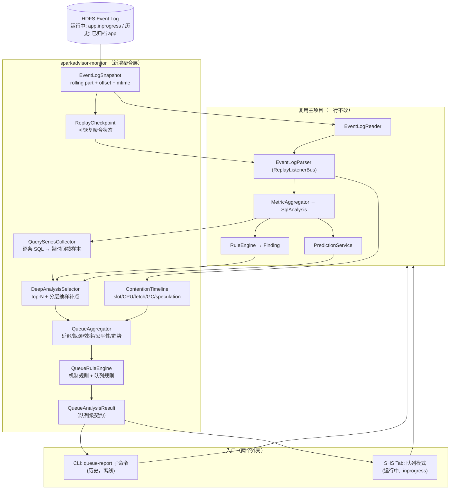
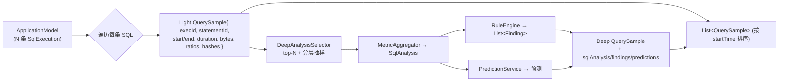
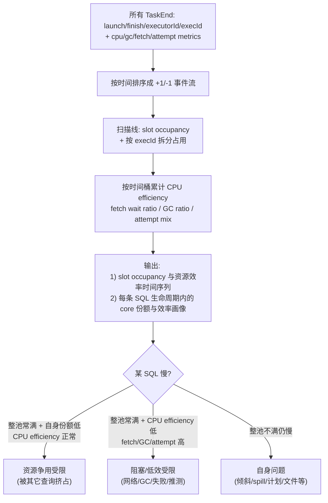
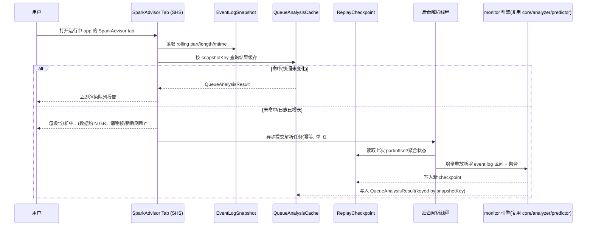
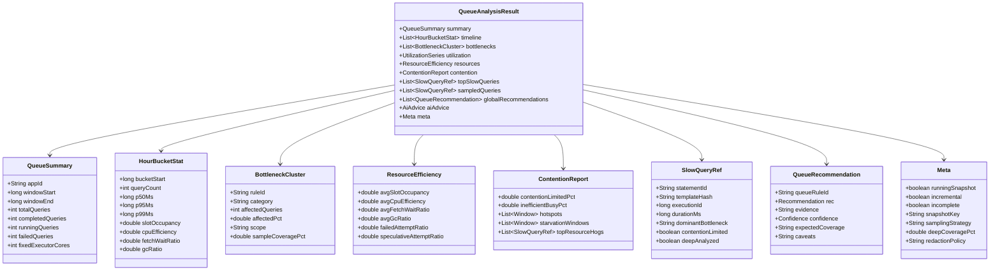

# SparkAdvisor Monitor — 查询队列分析层设计文档

> 本文档面向 **Claude Code 等 Code Agent**，作为 `sparkadvisor-monitor` 模块的实现蓝图。
> 它是主项目（见 `SparkAdvisor-design.md` 与仓库 `CLAUDE.md`）的**上层延伸**：把"单条 SQL 事后诊断"扩展为"长驻查询队列的跨 SQL 聚合分析"。
> 约定与主项目一致：生产产物兼容 Java 8（JDK 21 编译）、Spark 3.5.1、Spark/Hadoop 为 `provided`、复用 `core/analyzer/predictor/report` 全部能力、不手写事件 schema、Spark 内部 API 标 `// VERIFY@3.5.1`。

> **2026-05 评审修订口径**：队列报告不能只把许多单 SQL 结论相加。共享队列的核心价值是识别"固定资源池为什么慢"：到底是 slot 被占满、CPU 真忙、shuffle fetch 阻塞、GC/对象分配、失败/推测执行、还是 FAIR/FIFO 调度与 pool 配置导致的饥饿。后续实现与文档变更均按"运行时症状 + Spark 机制 + 置信度"组织。

---

## 1. 背景与目标

### 1.1 场景

存在一个**长期运行的共享查询队列**（一个长驻 Spark Application，如 `Carbon_Query_SDR`）：

- 1 个 Driver + **固定数量** Executor（不依赖动态分配）。
- 每天凌晨 **01:52 自动重启**（防止长时间运行内存碎片）。每轮运行期间执行成百上千条 SQL。
- 已开启 `spark.eventLog.enabled=true`，日志归档到 HDFS；一轮（约 22 小时）event log 约 **10 GB**。

### 1.2 目标

分析**一整轮运行（约 02:00–24:00）所有 SQL 的执行情况**，识别**队列级**性能瓶颈，给出**全局** Spark 调参建议（而非单条 SQL 的建议）。

### 1.3 两个入口（同一引擎，不同外壳）

| 入口 | 用途 | 数据 | 实时性 |
| --- | --- | --- | --- |
| **History Server tab（页面）** | 分析**当前正在运行**的查询队列 | 运行中 app 的 `.inprogress` 日志 | 不高（SHS 按 `update.interval` 间歇刷新，秒级到分钟级） |
| **CLI 子命令（后台）** | 分析**历史**已结束的查询队列 | 已归档的完整 app 日志 | 离线批处理 |

两者复用同一个 `QueueAnalyzer` 聚合引擎，符合主项目"引擎 → 结果契约 → 多种驱动外壳"的分层。

### 1.4 与单 SQL 分析的本质区别（为什么需要新模块）

1. **资源固定且共享**：executor 数固定、不能加。问题从"加 executor 能否更快"变成"**这池固定资源被所有 SQL 怎么瓜分**"。
2. **看分布与趋势，非单点**：单条慢 SQL 不重要；重要的是哪类瓶颈**反复出现**、延迟分位数随时间如何变化、是否存在大查询挤占小查询。
3. **全局参数的矛盾**：同一个 `spark.sql.shuffle.partitions` 可能对大查询好、对小查询是灾难。固定队列里这种矛盾最突出，是调参建议的核心依据。

---

## 2. 关键约束与设计取舍（务必遵守）

| 约束（来自用户） | 设计影响 |
| --- | --- |
| fat jar 放 Spark 目录即用，最多一个开关参数 | 复用现有 CLI fat jar + 现有 ui-plugin（ServiceLoader）。不新增部署物，不改 Spark 启动脚本 |
| **不做嵌入式修改、不影响 Spark 正常执行** | **禁止**把任何 listener/plugin 注册进生产查询队列的 Driver。只读 HDFS 日志，旁路分析 |
| 实时性要求不高 | 不需要秒级追读，也不在 Driver 侧常驻 listener；但 SHS 运行中分析必须避免"日志一增长就整份重放"，应支持可 checkpoint 的增量快照或明确降级 |
| 01:52 重启 = 天然边界 | 每轮 = 一个完整 app 日志。**无需跨 app 拼接**。历史分析针对单个归档 app；运行中分析针对当前 `.inprogress` app |
| 页面分析运行中、后台分析历史 | 页面入口读 `.inprogress`（容忍不完整）；CLI 入口读完整归档日志 |
| 队列资源固定 | 默认建议先考虑并发控制、分池、限流、AQE 分区策略与 SQL/计划优化；"增加 executor/core"只作为容量规划建议，不作为固定队列的首选动作 |
| LLM/报告安全 | 只发送/展示结构化 `QueueAnalysisResult`；SQL 文本、表名、HDFS 路径、配置值需经过统一 redaction，默认报告可只显示 StatementID 与模板哈希 |

> **路 2 决策记录**：页面 tab 挂在 **History Server**（读运行中 app 的 `.inprogress`），**不**挂运行中 Driver 的 4040 UI。理由：零侵入、不碰生产 Driver、真正复用 M3 的 `AppHistoryServerPlugin`；代价是非秒级实时（用户已接受）。详见主设计文档 §11.1。

---

## 3. 总体架构



**核心思想**：对一个 app 的 event log 建立快照边界（rolling part + offset + mtime），离线场景可完整重放，运行中 SHS 场景优先从 checkpoint 恢复增量状态；对**全部 SQL**收集轻量特征，对代表性 SQL 做深度 findings+预测；同时把 task interval 与 task metrics 投影到统一时间轴，联合分析 slot 占用、CPU 效率、fetch wait、GC 和 attempt 类型；最后做跨 SQL 聚合，产出队列级结果与全局建议。

> **增量性原则**：MVP 可以保留"后台全量重放 + 缓存"作为安全降级，但设计目标不能停留在 `appId + logLen` 缓存。长驻 10GB 级 `.inprogress` 一旦按 SHS update 周期增长，单纯文件长度缓存会退化为反复全量 IO/CPU。增量 checkpoint 至少记录 rolling file part、已读 byte offset、快照时间、未闭合 SQL、分位数估计器、瓶颈计数器和争用时间轴累加状态。

---

## 4. 模块与依赖

```
sparkadvisor-monitor   queue 聚合分析       → core, analyzer, predictor, report
```

新增模块 `sparkadvisor-monitor`，依赖方向单向向下，依赖 `core`（解析/聚合/争用时间轴）、`analyzer`（findings）、`predictor`（预测）、`report`（复用 `AnalysisResult` 渲染单条 SQL 详情）。

- **CLI 入口**：在现有 `sparkadvisor-cli` 加 `queue-report` 子命令，依赖 `monitor`。
- **Tab 入口**：在现有 `sparkadvisor-ui-plugin` 的 `SparkAdvisorPage` 加"队列模式"，依赖 `monitor`。
- **增量与安全子包**：`monitor` 内部新增 checkpoint/sampling/redaction 能力，但仍只产出纯 Java `QueueAnalysisResult`，不把 Spark 类型泄露给 CLI/UI/LLM。
- Spark/Hadoop 仍 `provided`。

---

## 5. 快照重放：从一个 app 日志收集所有 SQL

### 5.1 复用 + 扩展 collector

主项目的 `SparkEventCollector` 把**整个 app 快照**聚合成一个 `ApplicationModel`（含全部 SqlExecution/Job/Stage）。队列分析复用它作为离线与降级路径；运行中 SHS 场景在此基础上增加 `EventLogSnapshot` 与 `ReplayCheckpoint`，尽量只处理新增区间。

采集分两层：所有 SQL 都生成轻量 `QuerySample`；只有 top-N 与分层抽样样本进入完整 `MetricAggregator.analyze()` + `RuleEngine` + `PredictionService` 深分析。



### 5.2 10 GB 日志的性能策略（必须实现）

10 GB / 几百条 SQL 完全可解析，但**点 tab 不能让用户干等、不能 OOM**：

1. **流式逐行**：`ReplayListenerBus` 本就逐行；领域模型只保留聚合所需结构（增量分位数），**禁止**全量 task 驻留。沿用主项目内存策略。
2. **全量轻特征 + 代表性深分析**：对**全部** SQL 做轻量聚合统计（耗时、stage 数、task 数、input/shuffle/spill/GC/fetch wait/attempt 汇总、计划哈希/模板哈希、是否命中基础症状）。深度 findings+预测不只看最慢 top-N，还要加分层抽样补点，避免全局结论被少量超慢离群查询带偏。
3. **深分析选择器**：默认 `topN=50`，再从以下分层各取少量样本：时间桶、延迟分位段、计划哈希/模板哈希、表集合、是否 contention-limited、是否 fetch/GC/spill-heavy。若预算不足，top-N 优先，但 `QueueAnalysisResult.meta` 必须暴露深分析覆盖率与抽样策略。
4. **增量 checkpoint（Tab 入口优先）**：对 rolling event log 记录 `(partName, length, modificationTime, offset)` 与聚合状态；日志未变化直接返回缓存，日志增长时只处理新增区间。若底层 Spark replay API 暂不能稳定从 offset 恢复，则允许降级为后台全量重放，但必须限流、超时、记录 `incremental=false` 与 `degradedReason` 并降低 SHS 侧刷新频率。缓存/checkpoint key 必须同时包含 snapshot key 与分析参数（如 `topN`、分层样本数、bucket），避免不同报告配置误复用。
5. **异步 + 有界缓存（仅 Tab 入口）**：见 §9。CLI 入口是离线批处理，可同步全量；SHS 入口必须后台单飞、内存有界、失败不影响其它 app。

### 5.3 轻特征与深特征边界

| 类型 | 覆盖范围 | 字段示例 | 用途 |
| --- | --- | --- | --- |
| 轻特征 | 全部 SQL | duration、stage/task 数、input/shuffle bytes、spill bytes、GC ratio、fetch wait ratio、failed/speculative attempts、plan hash、statement/template hash | 延迟分位、趋势、全局瓶颈频次、抽样分层 |
| 深特征 | top-N + 分层样本 | `SqlAnalysis`、完整 findings、shuffle/executor prediction、关键路径、stage 分布、代表性证据 | 解释根因、生成可行动建议、下钻详情 |

> 轻特征必须来自 event log 的稳定字段与 SparkAdvisor 纯 Java 聚合结果，不引入 Spark 类型到 `QueueAnalysisResult`。深特征不足以代表全局时，所有队列建议的 `confidence` 必须下调，并在证据里展示样本覆盖率。

---

## 6. 资源争用时间轴（本模块核心技术点）

固定 executor 池下，最有价值也最难的分析：**任意时刻这池 core 被谁占用？这些 slot 里 CPU 是否真在工作？某条 SQL 慢是自身问题、资源争用，还是网络/GC/失败 attempt 把 slot 占住了？**

### 6.1 算法

每个 `TaskEnd` 事件带 `launchTime`、`finishTime`、`executorId`，且能关联到所属 stage→job→SQL execution。Task metrics 还提供 `executorRunTime`、`executorCpuTime`、`jvmGCTime`、`shuffleReadMetrics.fetchWaitTime`、shuffle bytes、spill bytes、TaskEndReason 等信息。把所有 task 投影成时间区间事件，扫描线积分：



复用主项目 `core/analyze/CoreTimeline` 的"按时间积分 core"骨架，**扩展为按 execution 归因**：新增 `ContentionTimeline`，除总占用外，记录每个时间片各 execution 占用的 core 数，并按桶累计 CPU/fetch/GC/attempt 等效率指标。

### 6.2 必须输出的资源效率指标

| 指标 | 计算口径 | 解释 |
| --- | --- | --- |
| `slotOccupancy` | `Σ task runtime / ∫ availableCores dt`，按 `spark.task.cpus` 折算 | slot 是否被占满；只回答"有没有占住资源" |
| `cpuEfficiency` | `Σ executorCpuTime / Σ executorRunTime`（单位换算后） | CPU 是否真在执行；低值说明可能被 IO、网络、GC、外部调用阻塞 |
| `fetchWaitRatio` | `Σ shuffleFetchWaitMs / Σ executorRunTime` | reducer 是否大量等待 shuffle block |
| `gcRatio` | `Σ jvmGCTime / Σ executorRunTime` | JVM GC/对象分配压力 |
| `failedAttemptRatio` | failed attempts / total attempts | 失败重试放大 wall clock，降低性能结论置信度 |
| `speculativeAttemptRatio` | speculative/killed/extra successful attempts / total attempts | 推测执行导致的重复 attempt，应和失败重试分开解释 |
| `fairnessSignal` | scheduler mode、pool、active SQL 份额、长时间低份额窗口 | 判断 FIFO/FAIR/pool 配置是否导致短查询饥饿或大查询独占 |

### 6.3 关键产物

- **整池利用率时间序列** `utilization(hourBucket)`：判断队列是长期跑满（资源不足）、大量空闲（并行度/调度问题），还是周期性被少数大查询占满（需隔离/限流）。
- **资源效率时间序列**：同一时间桶内同时展示 `slotOccupancy`、`cpuEfficiency`、`fetchWaitRatio`、`gcRatio`、attempt ratios。`slotOccupancy≈100%` 但 `cpuEfficiency` 很低时，不能简单建议加 executor/core。
- **每条 SQL 的"争用受限度"**：其生命周期内 `平均整池占用率`、`自身获得的 core 份额` 与资源效率指标。慢查询至少分成"自身瓶颈"、"资源争用受限"、"阻塞/低效受限"三类——**这决定调参方向完全不同**。
- **争用热点时段**：利用率持续 100% 且排队明显的时间窗。
- **公平性/饥饿窗口**：如果短查询在高占用窗口内长期只拿到极低 core 份额，且 scheduler mode/pool 信息显示 FIFO 或 pool share 不均，应输出 fairness/starvation 证据。

> 诚实声明：event log 不直接记录"排队等待"或完整 executor process CPU/内存。争用受限是**基于 task interval 与 task metrics 的推断**。当 `spark.scheduler.mode=FAIR`、多 pool、动态分配、`spark.task.cpus > 1`、speculation 或外部系统调用较多时，归因必须展示假设并降低置信度。

---

## 7. 队列级聚合（QueueAggregator）

输入 `List<QuerySample>` + `ContentionTimeline`，产出队列级指标。这里的聚合分成"全量轻特征统计"和"深分析样本统计"两层，报告必须显示两者的覆盖范围，避免把 top-N 的 findings 误读为全队列事实。

| 维度 | 内容 |
| --- | --- |
| **吞吐与延迟** | 总查询数、成功/失败数、每小时查询数；耗时 **P50/P95/P99**、最大值；按小时分桶的延迟趋势曲线 |
| **瓶颈聚类** | 分两类：全量轻症状（spill/fetch/GC/attempt/小 task 等）与深分析 findings。深分析聚类必须携带 `sampleCoverage` 与抽样策略；**反复出现且覆盖面足够的瓶颈**才是全局调参依据 |
| **资源效率** | `slotOccupancy`、`cpuEfficiency`、`fetchWaitRatio`、`gcRatio`、failed/speculative attempt ratios 的时间序列、峰值/均值/分位 |
| **争用与公平性** | 争用受限查询占比、阻塞/低效受限占比、争用热点时段、饥饿窗口、Top 占用查询（"资源大户"）、scheduler mode/pool 证据 |
| **慢查询榜** | Top-N 最慢 SQL（带 StatementID，可下钻到单 SQL 的 `AnalysisResult` 详情页/报告） |
| **分层样本榜** | 除最慢 SQL 外，展示被选入深分析的代表性样本：高频模板、不同时间桶、fetch/GC/spill-heavy、contention-limited 等 |
| **参数矛盾检测** | 同一固定参数下，"大查询欠并行" 与 "小查询过并行" 是否同时大量出现 → 静态值不合适的强信号 |
| **机制缺口** | 统计信息/CBO、次优 join strategy、DPP/runtime filter、pushdown/vectorization、busy-cluster AQE 分区策略等机制类信号的队列级出现频率 |

### 7.1 时间分桶

按小时（可配）分桶，覆盖 02:00–24:00。每桶统计查询数、延迟分位、slot occupancy、CPU efficiency、fetch wait ratio、GC ratio、attempt ratios，形成趋势序列。运行中分析（`.inprogress`）则覆盖 02:00 至当前时刻。

### 7.2 抽样偏差控制

`topN` 只代表"最慢查询"，不代表全队列。队列级结论需要以下保护：

1. `QueueAnalysisResult.meta` 记录 `totalQueries`、`lightAnalyzedQueries`、`deepAnalyzedQueries`、`deepCoveragePct`、`samplingStrategy`。
2. `BottleneckCluster` 区分 `scope=ALL_LIGHTWEIGHT` 与 `scope=DEEP_SAMPLE`；后者展示样本数与覆盖率。
3. 全局建议若只来自低覆盖率深样本，`confidence` 至多为 `MEDIUM`；若样本数不足阈值，降为 `LOW` 或只输出观察项。
4. 高频中等慢查询不能被 top-N 淹没：按模板哈希/计划哈希聚合其总耗时、出现次数和 P95，作为全局优先级输入。

---

## 8. 队列级规则与全局调参建议（QueueRuleEngine）

与单 SQL 的 `RuleEngine` 分开：单 SQL 规则看一条 SQL 的一个 stage；**队列规则看跨 SQL 的统计证据与共享资源机制**，产出**带统计支撑的全局建议**。队列规则必须显式区分三类结论：

- **容量/并发类**：资源池是否真的不够、是否需要限流/分池/权重调整。
- **效率/阻塞类**：slot 被占住但 CPU 不忙，是否 fetch wait、GC、失败 attempt、外部调用导致。
- **机制/计划类**：统计信息、AQE、join strategy、DPP/pushdown/vectorization 等是否在多条 SQL 上系统性失效。

同样 **AQE 感知**（复用 `AqeContext`）。对共享繁忙队列，尤其要把 `spark.sql.adaptive.coalescePartitions.parallelismFirst=false` 作为可解释的队列级策略候选，而不是只泛泛建议调 `shuffle.partitions`。

| 队列规则 | 触发条件（基于聚合统计） | 全局建议示例 |
| --- | --- | --- |
| Q1 普遍 spill 压力 | ≥X% 查询出现高 spill；并区分 reduce-side spill、operator spill hint、process overhead risk | 先查 skew/超大 reducer 分区/AQE advisory size；再评估 `spark.executor.memory`。只有存在 PySpark/native/off-heap/container 证据时，才把 `memoryOverhead` 放到主建议 |
| Q2 普遍长尾/倾斜 | ≥X% 查询出现长尾 task 或分区 bytes skew；AQE skew split 是否已生效需单独展示 | 确认 `spark.sql.adaptive.skewJoin.enabled`，结合 skew factor/threshold；已启用但仍长尾时提示 join key、盐值、预聚合或拆分异常 key |
| Q3 静态分区策略失配 | 大查询欠并行 与 小查询过并行 并存；或 busy cluster 下小 task 调度开销高 | 调 AQE：`advisoryPartitionSizeInBytes`、`coalescePartitions.initialPartitionNum`、`parallelismFirst=false`；减少固定 `shuffle.partitions` 对大小查询的双向伤害 |
| Q4 容量/并发受限 | `slotOccupancy` 长期接近 100%，`cpuEfficiency` 正常，且大量慢查询自身份额低 | 固定队列优先建议限流、隔离大查询、FAIR pool/minShare/weight、并发阈值；扩容 executor/core 仅作为容量规划选项 |
| Q5 阻塞/低效受限 | `slotOccupancy` 高但 `cpuEfficiency` 低，且 fetch/GC/attempt ratio 之一显著 | 不直接建议加资源；按主导信号转向 shuffle 网络/远端 fetch、GC/对象分配、失败重试、外部 UDF/服务调用 |
| Q6 资源闲置但慢 | `slotOccupancy` 长期偏低 + 查询仍慢 | 瓶颈不在资源量；检查 leaf parallelism、scan split、小文件、单分区算子、driver/listing、计划机制 |
| Q7 普遍小文件/scan split 问题 | ≥X% scan stage 命中 R5 或轻特征显示大量小 input task | 推动 compaction；调 `spark.sql.files.maxPartitionBytes`、`openCostInBytes`、`maxPartitionNum`；目录极多时评估 parallel partition discovery |
| Q8 普遍 GC/对象分配压力 | ≥X% 查询高 GC，或 GC 与对象型 UDF/非向量化/高 spill 同时出现 | 优先审查 UDF、codegen/vectorized reader、对象分配与缓存布局；再调 executor memory、分区大小或 GC 参数 |
| Q9 FAIR/FIFO 饥饿 | 短查询在高占用窗口长期低份额；scheduler mode/pool 信息显示 FIFO 或 pool share 不均 | 使用 FAIR scheduler、独立 pool、权重/minShare、长短查询隔离、并发队列控制 |
| Q10 统计信息/CBO 失真 | 多条 join 相关规则命中且 stats 缺失/过期，或计划估计与 runtime stats 偏差大 | 先补 `ANALYZE TABLE`/列统计、核对 `EXPLAIN COST`/runtime stats，再考虑 broadcast/AQE join 策略参数 |
| Q11 队列级次优执行机制 | 多条 SQL 疑似 pushdown/vectorization/DPP/runtime filter/AQE join conversion 未生效 | 输出机制检查清单，定位配置、数据格式、UDF 屏障、join type/hint 冲突，而不是直接给单一参数 |

每条队列建议必须携带：**证据**（命中比例、样本数、相关分位值、轻/深分析覆盖范围）+ **置信度** + **预期覆盖范围**（"预计影响过去 22h 的 N% 慢查询"）+ **反例/降级条件**（例如 FAIR 多 pool、speculation、外部 executor metrics 缺失、样本覆盖率不足）。阈值集中到 `QueueRuleThresholds`（与单 SQL 的 `RuleThresholds` 分开）。

---

## 9. 入口一：History Server Tab（运行中队列）

### 9.1 复用 M3 tab，新增"队列模式"

主项目 M3 的 `SparkAdvisorPage` 已能按 StatementID 出单条 SQL 报告。这里**同一个 tab** 增加一个队列模式：进入某 app 的 SparkAdvisor tab 时，默认展示**该 app 的队列级报告**（`QueueAnalysisResult` 渲染）；仍保留 StatementID 输入框用于下钻单条 SQL。



### 9.2 运行中 `.inprogress` 的处理（关键）

- **SHS 默认就列出运行中 app**（incomplete），按 `spark.history.fs.update.interval`（默认 10s）依据**文件大小变化**间歇刷新。我们读到的就是当时的 `.inprogress` 快照。
- **容忍不完整**：尾部可能截断、最后若干 SQL 未闭合（无 `SQLExecutionEnd`）。聚合层把"未结束的 SQL"单列为"运行中"，**不混入**已完成统计；`QueueAnalysisResult.meta` 标 `runningSnapshot=true` 和快照时间。
- **快照键 = appId + rolling part 列表 + 每个 part 的 length/mtime**：日志没增长就直接返回缓存；日志增长时优先从 checkpoint 的最后 part/offset 继续处理，避免重复解析 10 GB。UI/SHS 的实际缓存键还需拼入 `topN`、分层样本数、bucket 等分析参数。
- **checkpoint 内容**：至少包含已完成 SQL 轻特征、未闭合 SQL 状态、分位数估计器、瓶颈计数器、时间桶资源效率累加器、ContentionTimeline 扫描线状态、深分析样本选择器状态。checkpoint 版本需要写入 `meta.schemaVersion`，不兼容时允许丢弃重建。
- **降级路径**：如果 checkpoint 缺失、part 被压缩/清理、尾部截断无法恢复，后台任务可全量重放当前快照，但 `meta.incremental=false`、`meta.incomplete=true` 或 `meta.degradedReason` 需明确暴露。
- **异步单飞**：同一 app 的解析任务全局只跑一个，避免多用户点击触发并发重放打爆 SHS。**绝不**在 SHS 的 UI 请求线程里同步解析 10 GB（会卡死页面、可能 OOM）。
- **资源隔离与 circuit breaker**：解析线程池大小、单 app CPU 时间、最大堆占用、单次增量字节数、后台任务超时都要可配置；连续失败时熔断一段时间，只展示上次成功快照和失败原因，**绝不影响 SHS 对其它 app 的服务**。

### 9.3 SHS 端建议配置（写入 DEPLOY 文档，不强制）

- 适当增大 SHS 堆（解析 10 GB 需要余量）。
- `spark.eventLog.rolling.enabled=true` + `maxFileSize`：让长驻队列的日志滚动成多文件，便于增量与控制单文件大小（**注意** compaction 是有损的，会丢弃部分历史事件，需权衡）。
- `spark.history.fs.update.interval` 视实时性需求设定；如果未实现增量 checkpoint，不建议把刷新间隔设得过短。
- 可选 SHS fast path：对于已结束 app，可让离线 CLI 先生成 `QueueAnalysisResult` JSON，SHS tab 优先读取该产物；只有缺失或过期时才回放 event log。

---

## 10. 入口二：CLI 子命令（历史队列，离线）

在 `sparkadvisor-cli` 新增 `queue-report` 子命令（与现有 `analyze` 并列）：

```
java -jar sparkadvisor-cli.jar queue-report \
  --path hdfs:///spark2x/eventLog/<已结束的 Carbon_Query_SDR app 日志> \
      --format html|json \
      --out ./queue-report.html \
      --top 50 \              # 最慢 SQL 深分析数量
      --sample-per-stratum 5 \ # 每个分层补充深分析样本数（可选）
      --bucket 1h             # 时间分桶粒度
# Kerberos 由 bin/sparkadvisor 启动脚本的固定 kinit 处理（与主项目一致）
```

- 离线批处理，可同步全量解析（无 UI 线程阻塞顾虑）。
- 典型用法：每天重启后，对上一轮归档日志跑一次，产出"昨日队列健康报告"。
- 离线模式也应输出轻/深分析覆盖率；如果使用 `--top` 但不启用分层补样，报告需要说明全局 findings 可能偏向最慢离群查询。
- 复用 `bin/sparkadvisor` 启动脚本（含 `source bigdata_env` + `kinit`；JDK 9+ 运行时条件添加 `--add-opens`）。

---

## 11. 结果契约：QueueAnalysisResult

队列级统一契约（纯 Java value type，无 Spark 类型，可 JSON 序列化；与单 SQL 的 `AnalysisResult` 平级）：



- 复用 `core/finding/Recommendation`、`core/predict/Confidence`、`report` 的 `AiAdvice`。
- `SlowQueryRef` 携带 StatementID，HTML 报告中可链接/下钻到该 SQL 的单条 `AnalysisResult` 详情（复用 `HtmlReportWriter.renderBody`）。
- `BottleneckCluster.scope` 必须标明来自全量轻特征还是深分析样本；深分析覆盖率不足时，报告与 LLM prompt 都必须保留这个 caveat。
- **F4 顾问可直接复用**：把已脱敏的 `QueueAnalysisResult` JSON 喂给 LLM（仍是结构化摘要，非 raw log），产出队列级 AI 调参建议。LLM 不接触 raw event log、HDFS 凭证、完整 SQL 明文或未脱敏配置。

---

## 12. HTML 报告结构（队列视图）

复用 `report` 的样式与渲染基建；新增队列版面：

队列概览（app/窗口/查询数/固定 core/快照状态）→ 延迟趋势（按小时 P50/P95/P99 折线，内联 SVG）→ slot occupancy 与 CPU/fetch/GC/attempt 效率时间序列 → 瓶颈聚类（区分全量轻特征与深样本 findings）→ 争用与公平性报告（争用受限、阻塞/低效受限、热点时段、饥饿窗口、资源大户）→ 慢查询 Top-N 与分层样本（可下钻单 SQL）→ **全局调参建议**（带证据/置信度/预期覆盖/caveats）→ AI 队列建议占位（F4）→ 内嵌脱敏 JSON 契约。

运行中快照在页头显著标注 `运行中快照 @ HH:MM，含 K 条未完成查询`。
若本次结果来自全量降级重放、checkpoint 恢复失败、rolling compaction 有损日志或深分析样本覆盖率不足，页头必须显示黄色 caveat，而不是把报告表现成完整精确结论。

---

## 13. 关键技术难点清单（给 Code Agent）

1. **10 GB 不阻塞、不 OOM**：流式重放 + 全量轻特征 + top-N/分层深分析 + Tab 入口异步单飞 + 有界缓存。CLI 入口可同步。
2. **增量 checkpoint**：SHS 运行中分析不能长期依赖 `appId+logLen` 全量重放；需维护 rolling part/offset 与聚合状态。降级全量重放时必须标注 `incremental=false` 和原因。
3. **`.inprogress` 容错**：未闭合 SQL 单列为运行中，不混入完成统计；`meta` 标快照与不完整。
4. **争用归因**：`ContentionTimeline` 扫描线积分，按 execution 拆分占用；同时输出 CPU efficiency、fetch wait、GC、failed/speculative attempts。event log 无显式排队，争用是推断，需诚实标注。
5. **FAIR/多 pool/动态分配**：默认 FIFO/单池假设只适合简单队列；检测到 FAIR、多 pool、`spark.task.cpus > 1`、speculation 或动态分配时，相关结论要降低置信度并展示假设。
6. **rolling + compaction**：长驻队列可能开滚动日志；compaction 有损（丢事件），分析结果需标注可能不完整。`EventLogReader` 已处理 rolling 目录形态，复用。
7. **队列规则的统计阈值**：基于"命中比例 + 样本数 + 轻/深覆盖率"，避免被极少数离群 SQL 带偏；阈值集中到 `QueueRuleThresholds`。
8. **下钻一致性**：慢查询详情必须与单 SQL 入口产出完全一致（同一 `MetricAggregator`/`RuleEngine`），保证页面与 CLI 结论不矛盾。
9. **安全脱敏**：报告、JSON、LLM prompt 统一 redaction；默认隐藏完整 SQL、HDFS 路径、token/secret 样式配置值，优先展示 StatementID、模板哈希、匿名化表名。
10. **解耦**：`monitor` 引擎产出 `QueueAnalysisResult`，CLI/Tab 只是渲染外壳；Spark UI 接入沿用 M3 的 VERIFY@3.5.1 约定。

---

## 14. 安全、脱敏与权限边界

队列报告会聚合大量 SQL 与路径信息，比单 SQL 报告更容易泄漏业务结构。安全模式必须作为一等设计，而不是渲染层临时替换字符串。

| 对象 | 默认处理 | 说明 |
| --- | --- | --- |
| SQL 文本 | 默认不在队列总览展示全文；只展示 StatementID、executionId、模板哈希；下钻时按权限展示 | LLM prompt 不发送 SQL 全文，除非用户显式开启且已 redaction |
| 表名/库名 | 可匿名化为稳定 hash 或保留白名单前缀 | 便于聚合相同模板，又不暴露业务命名 |
| HDFS/S3/OBS 路径 | 脱敏 authority、租户、用户目录、token 样式片段 | 报告只需显示 path hash 或末级匿名标识 |
| Spark conf/env | 复用 `spark.redaction.regex` 语义，并额外过滤 secret/token/password/keytab/principal 等 | 不把凭证、AK/SK、Kerberos keytab 路径发送给 LLM |
| `QueueAnalysisResult` JSON | 内嵌 HTML 前已脱敏；`meta.redactionPolicy` 标明策略 | JSON 是唯一契约，脱敏应发生在契约生成或序列化前 |
| SHS tab | 继承 History Server 访问控制；若无法确认 ACL，默认展示安全摘要 | 不绕过 SHS/HDFS/YARN/K8s 的权限模型 |

运行环境注意：

- 安全 HDFS/YARN 下复用 SHS 或 CLI 的 Kerberos principal/keytab；不要在报告或日志中输出 ticket、keytab 路径和 principal 细节。
- Kubernetes 场景下 service account、token、secret 只用于读取 event log 或平台元数据，不进入 `QueueAnalysisResult`。
- 可选接入 YARN RM / K8s API 时，平台元数据只能作为归因增强信号；获取失败不能影响 event-log 主路径。

---

## 15. 验证方法与上线方案

队列分析需要验证"中间指标是否可信"，不能只看最终建议是否看起来合理。建议把验证拆成规则真值、队列归因、增量可扩展性、安全脱敏四类。

| 测试层级 | 场景 | 期望信号 | Oracle |
| --- | --- | --- | --- |
| 单元测试 | 热 key join 倾斜 | R1/Q2 命中；AQE skew split 后严重度下降 | 最终自适应计划 + task bytes 分布 |
| 单元测试 | group by / sort 强制 spill | R2/R11/Q1 命中；reduce-side 与 operator hint 分开 | task spill metrics + plan operators |
| 单元测试 | 过高 reducer 并行度 | R4/Q3 命中，建议指向 AQE/advisory size | task duration 分布 |
| 单元测试 | 远端 shuffle 拉取慢 | R9/Q5 命中，`fetchWaitRatio` 主导 | fetchWait/remoteBytesRead |
| 单元测试 | executor kill / 失败重试 / speculation | R10/Q5 命中，但失败与 speculation 分开统计 | TaskEndReason / attempts |
| 集成测试 | FIFO 下长查询压住短查询 | contention hotspot 与 starvation 命中 | 时间轴 + latency buckets |
| 集成测试 | FAIR pool / minShare / weight | 争用置信度随 pool 证据调整，fairness 指标可见 | scheduler mode / pool 属性 |
| 回归测试 | `.inprogress` 尾部截断 | running snapshot 正确，不污染 completed stats | partial log replay |
| 增量测试 | rolling part 追加、切 part、checkpoint 恢复 | 只处理新增区间；增量结果与全量重放一致 | full replay diff |
| 压测 | 1GB / 10GB / 50GB event log | 解析吞吐、峰值堆、缓存命中、P95 页面延迟达标 | benchmark harness |
| 安全测试 | SQL/路径/conf 含 token、password、keytab | HTML、JSON、LLM prompt 全部脱敏 | redaction golden files |

上线路径：


灰度 KPI：

- 工程指标：队列报告生成延迟、峰值内存、checkpoint 命中率、cache hit rate、SHS 页面 P95 延迟、失败/熔断次数。
- 诊断指标：规则 precision、false-positive rate、与 Spark UI runtime statistics / `EXPLAIN COST` / stage-task summaries 的一致性。
- 业务指标：队列 P95/P99 延迟、平均 slot occupancy、CPU efficiency、fetch-wait ratio、GC ratio、失败 attempts/query、短查询饥饿比例、建议采纳后的回归收益。

---

## 16. 分阶段实施

| 里程碑 | 交付 | 验收 |
| --- | --- | --- |
| Q-M1 | `monitor` 核心：收集 `QuerySample` + 全量轻特征 + `QueueAggregator`（延迟分位/瓶颈聚类/趋势）+ `QueueAnalysisResult` + CLI `queue-report` 出 JSON/HTML | 对一份多 SQL 样本日志，分位数/聚类与人工核算一致；轻/深分析覆盖率正确 |
| Q-M2 | `ContentionTimeline` 多维资源归因 + `QueueRuleEngine` 全局建议（Q1–Q11）+ HTML 队列版面 | 能区分资源争用受限、fetch/GC/attempt 阻塞受限、自身计划瓶颈；全局建议带证据/置信度/caveats |
| Q-M3 | SHS tab 队列模式：`.inprogress` 读取 + 异步单飞 + 有界缓存 + 运行中标注；CLI 与 Tab 复用同引擎 | 运行中 app 打开 tab 不阻塞；解析失败不影响 SHS 其它 app；降级状态可见 |
| Q-M3.5 | rolling event log 增量 checkpoint + SHS fast path 读取离线产物 | rolling part 追加/切换时增量结果与全量重放一致；10GB 运行中 app 不因每次增长重复全量回放 |
| Q-M4 | F4 队列级 LLM 顾问（脱敏 `QueueAnalysisResult` JSON 喂模型） | LLM 仅消费结构化脱敏结果；规则版与 LLM 版可切换；LLM 失败优雅降级 |
| Q-M5 | 安全与验证体系：redaction golden tests、压测、规则 oracle 回归、灰度 KPI | HTML/JSON/prompt 无敏感信息；1GB/10GB/50GB 压测指标达标；核心规则误报率可量化 |

---

## 17. 附录：建议骨架

```
sparkadvisor-monitor/
├── pom.xml
└── src/main/java/io/sparkadvisor/monitor/
    ├── QueueAnalyzer.java          # 门面：path → QueueAnalysisResult
    ├── collect/QuerySeriesCollector.java   # 全量轻特征 → List<QuerySample>
    ├── collect/QuerySample.java
    ├── collect/DeepAnalysisSelector.java   # top-N + 分层抽样补点
    ├── checkpoint/EventLogSnapshot.java    # rolling part/offset/mtime
    ├── checkpoint/ReplayCheckpoint.java    # 可恢复聚合状态
    ├── contention/ContentionTimeline.java  # slot/CPU/fetch/GC/attempt 归因
    ├── aggregate/QueueAggregator.java      # 分位/聚类/趋势/效率/公平性
    ├── aggregate/QueueAnalysisResult.java  # 队列级契约 + 子 value type
    ├── rule/QueueRuleEngine.java           # Q1–Q11
    ├── rule/QueueRuleThresholds.java
    ├── security/QueueRedactor.java         # SQL/路径/conf/JSON/LLM prompt 脱敏
    └── render/QueueHtmlWriter.java         # 复用 report 样式/基建
# CLI:  sparkadvisor-cli 加 QueueReportCommand（queue-report 子命令）
# Tab:  sparkadvisor-ui-plugin 的 SparkAdvisorPage 加"队列模式"分支
```
