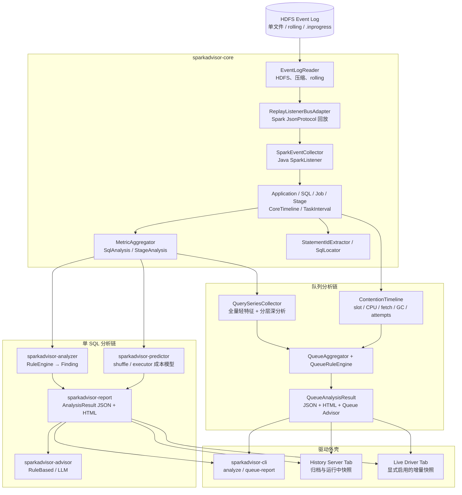

# SparkAdvisor 设计文档

| 项 | 内容 |
|---|---|
| 文档版本 | v2.0（合并版） |
| 状态 | 与当前代码基线对齐；49 条稳定规则已实现，能力型证据持续增强 |
| 适用版本 | Apache Spark 3.5.1 / Scala 2.12 |
| 运行时基线 | 生产代码兼容 Java 8，使用 JDK 21 编译 |
| 目标场景 | 单 SQL 事后诊断 + 长驻共享查询队列的一整轮聚合分析 |
| 交付形态 | CLI、HTML/JSON 报告、History Server Tab、可选 Live Driver Tab、规则/LLM Advisor |
| 规则权威文档 | [rules.md](rules.md) —— 规则 ID、触发公式、阈值、证据、建议和联动关系的单一事实源 |

本文档合并并取代仓库根目录原有的 [SparkAdvisor-design.md](../SparkAdvisor-design.md) 与 [SparkAdvisor-monitor-design.md](../SparkAdvisor-monitor-design.md) 作为后续总体设计入口。两份旧文档保留为历史设计记录；若其内容与本文档或当前代码冲突，以本文档描述的架构边界、当前代码和 `rules.md` 的规则定义为准。

需要特别区分两个口径：

- **当前实现基线**：仓库已经完成 Java 多模块、单 SQL 分析、预测、Advisor、队列分析、CLI、History Server 与 Live Driver UI 接入；生产报告默认使用稳定的 S/Q/DQ 规则 ID。
- **规则体系**：`rules.md` 定义并驱动 49 条稳定规则，即 S 系列 29 条、Q 系列 18 条、DQ 系列 2 条。旧 `R1–R11` 引擎只保留为迁移兼容入口，不再作为默认报告规则源。

---

## 1. 背景、目标与范围

### 1.1 项目定位

SparkAdvisor 是一个以 Java 8 运行时兼容为目标、面向 Spark 3.5.1 的 Event Log 离线分析与调优顾问。它直接读取 HDFS 上的单文件或 rolling event log，复用 Spark 自带的 `ReplayListenerBus` / `JsonProtocol` 还原事件，计算关键路径、资源利用率和任务分布等硬指标，通过规则和成本模型给出带证据的建议，并输出自包含 HTML 或 JSON 报告。

项目覆盖两个互补视角：

1. **单 SQL 视角**：通过 SQL 开头的 `/* StatementID */` 定位 execution，回答“慢在哪里、证据是什么、应改 SQL、会话参数还是集群参数”。
2. **队列视角**：分析长驻 Spark Application 的整轮查询，回答“固定资源池如何被共享、慢是查询自身还是争用、哪些问题反复出现、全局参数是否互相冲突”。

### 1.2 生产场景

典型目标是一个长期运行的共享查询队列：1 个 Driver、固定数量 Executor，每天 01:52 左右重启，一轮约 22 小时，执行数百至上千条 SQL，event log 可达 10 GB。该场景有三个核心问题：

- Spark UI / History Server 的保留条数有限，历史 SQL 难以完整回溯；
- 人工逐层点击 Job → Stage → Task 无法批量复用，也难以跨轮比较；
- 单条 SQL 的慢可能来自自身计划、数据分布、节点异常，也可能只是共享资源池在当时被占满。

### 1.3 目标

- 旁路读取归档或 `.inprogress` event log，不侵入生产查询执行路径；
- 流式、低内存处理 GB 级日志，默认不保存全部 task 明细；
- 精确计算可从 event log 确定的硬指标，并显式标记缺失或不完整数据；
- 通过统一结构化契约驱动 CLI、报告、UI 和 Advisor；
- 单 SQL 结论可追溯到 execution/stage，队列结论可下钻到代表性 SQL；
- 建议区分会话参数、重启参数、SQL 改写和数据治理四种生效层级；
- 预测必须携带假设、置信度和反转条件，不把成本模型估计包装成实测事实；
- 利用每日重启边界做 `RESTART_CONF` 建议的前后轮验证。

### 1.4 非目标

- 不自动修改 Spark 配置、SQL 或生产数据；
- 不把 SparkAdvisor 做成通用 APM，不替代 YARN/Kubernetes、OS、HDFS、网络和磁盘监控；
- 不让 LLM 直接读取原始 event log、计算指标或决定阈值；
- 不手写并长期维护 Spark 事件 JSON schema；
- 不引入前端构建链或外部数据库作为核心运行前提；
- 不承诺从 event log 单独得出主机硬件故障、真实进程 CPU 或调度器显式排队时间等日志外事实。

### 1.5 设计原则

1. **Spark 官方回放优先**：事件反序列化交给 Spark，业务代码只消费已还原事件。
2. **结构化契约优先**：单 SQL 使用 `AnalysisResult`，队列使用平级的 `QueueAnalysisResult`；接入层不能直接读取 Spark 领域对象绕过契约。
3. **硬指标与估计分离**：实测值、推断归因、预测值分别标识。
4. **聚合为主、必要明细为辅**：task 分布增量聚合；只有调试或队列争用时间线需要时才保留受控的轻量明细。
5. **规则可解释**：每个 finding 必须给出证据、建议、影响范围和可信边界。
6. **单 SQL 与队列互相校验**：队列上下文用于校正单 SQL 归因，单 SQL 证据用于解释队列聚类。
7. **旁路失败不影响 Spark**：CLI、SHS Tab 或 Advisor 的异常不能影响原 Spark Application 和 History Server 的基本功能。

---

## 2. 总体架构

### 2.1 逻辑架构



### 2.2 两条数据流

单 SQL 分析：

```text
event log → ApplicationModel → StatementID/execution 定位
          → SqlAnalysis → Finding + Prediction
          → AnalysisResult → Advisor → HTML/JSON/UI
```

队列分析：

```text
event log → ApplicationModel + TaskInterval/CoreTimeline
          → 全量 QuerySample + top-N/分层深分析
          → ContentionTimeline + QueueAggregator + QueueRuleEngine
          → QueueAnalysisResult → Queue Advisor → HTML/JSON/UI
```

### 2.3 部署形态

| 形态 | 入口 | 数据 | 特点 |
|---|---|---|---|
| 离线单 SQL | CLI `analyze` | 完整或 `.inprogress` 日志 | 同步生成 HTML/JSON，可按 StatementID 定位 |
| 离线队列 | CLI `queue-report` | 一整轮 app 日志 | 全量轻分析、代表性深分析、队列报告 |
| History Server | `AppHistoryServerPlugin` | SHS 可访问的归档或运行中日志 | 零侵入生产 Driver；懒解析、异步单飞与缓存 |
| Live Driver | `SparkPlugin` | Driver listener 增量快照 | 显式启用；面向运行中诊断，不替代离线深分析 |

CLI 与 UI 只是不同外壳，必须复用同一分析引擎和结果契约。

---

## 3. 工程约束、模块与依赖

### 3.1 硬约束

- 生产源码使用 Java，兼容 Java 8；JDK 21 编译，`maven.compiler.release=8`；测试可使用 JDK 21 语法。
- 禁止用 Scala 编写生产源码，但允许从 Java 调用 Spark 3.5.1 的 Scala 2.12 产物。
- Spark/Hadoop 依赖全部为 `provided`，不打入 fat jar；运行时由 `/opt/client` 或目标 Spark 发行版提供。
- HTTP 调用统一使用 Apache HttpClient 4.5.14，不使用 Java 11 `java.net.http`。
- 前端只用原生 HTML/CSS/JS 与内联 SVG，不引入 npm、webpack、Vite 等构建链。
- Spark 内部或版本敏感 API 处保留 `// VERIFY@3.5.1`。
- Scala `Map`、`Seq`、`Option` 在 core 内通过 `scala.collection.JavaConverters` 转为 Java 类型，上层模块不感知 Scala。

### 3.2 Maven 模块

| 模块 | 责任 | 主要依赖方向 |
|---|---|---|
| `sparkadvisor-core` | HDFS 读取、Spark 回放、领域模型、StatementID 定位、指标聚合、关键路径、core 时间线 | Spark/Hadoop `provided` |
| `sparkadvisor-analyzer` | 单 SQL `RuleEngine`，产出 `Finding` | → core |
| `sparkadvisor-predictor` | shuffle partition 与 executor/core 成本模型预测 | → core、analyzer |
| `sparkadvisor-report` | `AnalysisResult`、JSON 和单文件 HTML 渲染 | → core、analyzer、predictor |
| `sparkadvisor-advisor` | `TuningAdvisor`、规则 Advisor、LLM Provider、Prompt 与响应解析 | → report |
| `sparkadvisor-monitor` | 全量查询轻特征、分层抽样、争用时间线、队列聚合、队列规则、队列报告与 Advisor | → core、analyzer、predictor、report、advisor |
| `sparkadvisor-cli` | picocli 命令入口 | → 上述业务模块 |
| `sparkadvisor-ui-plugin` | History Server 与 Live Driver UI 适配 | → core、report、monitor，Spark `provided` |

依赖方向保持单向。`Finding` / `Recommendation` / `Severity` 位于 core，预测契约也位于 core，避免 report 与产出方形成反向依赖。

### 3.3 当前实现与中间方案的取舍

当前项目不是 Python/Jinja2 工具，也没有把按日 JSONL 指标仓库设为核心事实源。现有实现以 Java 领域模型流式聚合，输出 `AnalysisResult` / `QueueAnalysisResult` JSON 和 HTML。若未来需要跨轮基线仓库、DuckDB/Parquet 或按日 JSONL，应作为契约的持久化/索引层引入，并满足：

- 不能替代或绕过结果契约；
- 不能让规则引擎直接重新解析 raw event log；
- schema 必须版本化、字段只增不破坏；
- 敏感字段在持久化和 LLM 发送前统一脱敏；
- 未实现的存储能力不能写成当前可用特性。

---

## 4. Event Log 读取与解析

### 4.1 关键决策：复用 Spark 回放

Event log 是每行一个 JSON 事件。SparkAdvisor 不定义整套事件 POJO，而是：

1. `EventLogReader` 打开单文件或按序遍历 rolling 目录并处理压缩；
2. `ReplayListenerBusAdapter` 创建 `ReplayListenerBus`；
3. 注册 Java 实现的 `SparkEventCollector extends SparkListener`；
4. 调用 Spark 3.5.1 暴露的 `replay(InputStream, String, boolean, scala.Function1<String,Object>)`，过滤器使用 `ReplayListenerBus.SELECT_ALL_FILTER()`；
5. Spark 内部通过 `JsonProtocol.sparkEventFromJson` 还原事件并回调 collector；
6. collector 将 Scala 对象转换成纯 Java 领域模型。

这与 History Server 回放日志的思路一致，能降低 Spark 小版本字段演化带来的维护成本。只有单行调试场景才允许反射调用 `JsonProtocol`，并必须标记版本核对。

### 4.2 输入形态

| 形态 | 处理 |
|---|---|
| 单文件 | 直接流式回放 |
| Rolling 目录 | 识别 `eventlog_v2_*`，按 `events_N_*` 序号读取，忽略状态标记文件 |
| 压缩文件 | 使用 Hadoop/Spark codec 流式解压 snappy/lz4/zstd 等格式 |
| `.inprogress` | 允许回放，未闭合实体与结果标记 `incomplete=true` |
| 被 compaction 的日志 | 继续 best-effort 解析，但报告声明可能缺失历史 task 事件 |

读取层不得整文件加载到内存。Kerberos 登录不在 Java 代码中实现，由启动脚本先 `source /opt/client/bigdata_env`、再 `kinit`，Hadoop `UserGroupInformation` 使用 ticket cache 访问 HDFS。

### 4.3 事件订阅

| 事件 | 用途 |
|---|---|
| `ApplicationStart/End` | app 元数据和生命周期边界 |
| `EnvironmentUpdate` | Spark 配置、executor 资源、AQE 与调度器上下文 |
| `ExecutorAdded/Removed` | 可用 core 随时间变化、动态分配/异常移除证据 |
| `JobStart/End` | SQL execution 与 stage 关联、作业生命周期 |
| `StageSubmitted/Completed` | DAG 父子关系、stage attempt、提交/完成时间 |
| `TaskEnd` | TaskMetrics、失败原因、task 区间与增量分布 |
| `SQLExecutionStart/End` | SQL 原文、executionId、初始计划与起止时间 |
| `SQLAdaptiveExecutionUpdate` | AQE 最终计划和有效分区变化 |
| `ThriftServerOperationStart` | STS 场景的 SQL 原文与 operation 信息；按类名反射匹配，缺 jar 不报错 |

SQL 事件没有 `SparkListener` 具名回调，统一在 `onOtherEvent` 中按类型分发。

### 4.4 StatementID 与关联链

SQL 开头约定为：

```sql
/* 20260521_abc123 */ select ...
```

提取主来源是 `SparkListenerSQLExecutionStart.description`，STS 场景可用 `SparkListenerThriftServerOperationStart.statement` 补充。正则只接受文本最前部的首个注释，不能误取 SQL 中部的普通注释。关联链为：

```text
StatementID → SQL execution → Job → Stage(attempt) → Task
```

- execution 与 job 通过 `spark.sql.execution.id` 关联；
- StatementID 可能一对多，`SqlLocator` 返回列表并按耗时排序；
- 输入纯数字且无 StatementID 命中时，可回退按 executionId 查找；
- 无注释或无法关联不应中断 app 分析，只保留空 StatementID 或未归属实体；
- 必测：头部注释命中、无注释、SQL 中部注释不误取、description 与 Thrift Server 两路来源。

### 4.5 领域模型与内存策略

核心模型为 `ApplicationModel → SqlExecution → Job → Stage`，并包含 `ExecutorEvent`、`CoreTimeline` 和按需开启的 `TaskInterval`。Stage 默认只保存聚合后的 `TaskMetricStats`，不保存全部 task。

`onTaskEnd` 立即把时长、shuffle、input/output、spill、GC、反序列化、fetch wait 等值送入 t-digest/聚合器，最终形成 `Distribution`。这使常规单 SQL 分析的内存复杂度与 task 总数基本解耦。`--keep-raw` 仅用于调试；队列争用分析保存的 `TaskInterval` 也只包含时间、execution 归属和必要效率字段，不等同于保留完整 Task 事件。

### 4.6 完整性与降级

- 缺少 `ApplicationEnd`、`SQLExecutionEnd`、`JobEnd` 或 `StageCompleted` 时，将实体/结果标为不完整并 best-effort finalize；
- 缺少 executor 增删事件时，core 时间线回退到配置中的 executor/core 数；
- 缺少 AQE 更新时使用初始物理计划，不伪造最终计划；
- 缺少 task 指标时对应规则跳过或降低置信度；
- 任何坏行、截断或可选事件缺失都不能让整份分析无条件失败；
- 新版 DQ-01/DQ-02 的完整性与时间一致性语义以 `rules.md` 为准，迁移完成后应把这些降级规则显式写入结果契约。

---

## 5. 结果契约

### 5.1 `AnalysisResult`：单 SQL 唯一契约

`AnalysisResult` 不包含任何 Spark 类型，主要字段为：

```text
AnalysisResult
├── app                 AppSummary
├── targetSql           SqlAnalysis
├── findings[]          Finding
├── shufflePrediction   ShufflePartitionPrediction
├── executorPrediction  ExecutorScalingPrediction
├── aiAdvice            AiAdvice（可空）
└── meta                版本、生成时间、sourcePath、incomplete
```

CLI、单 SQL HTML、History/Live UI 和 `TuningAdvisor` 都消费它。任何新增单 SQL API 或页面不得绕过该契约直接读取 `ApplicationModel`、`Stage` 或 Spark 事件对象。

### 5.2 `QueueAnalysisResult`：队列级平级契约

队列级结果不是多个 `AnalysisResult` 的简单数组，而是面向共享资源池的独立聚合契约：

```text
QueueAnalysisResult
├── summary                  app、窗口、完成/运行/失败查询数、固定 core
├── timeline[]               分桶查询量、P50/P95/P99、task 数、并发和效率
├── bottlenecks[]            全量轻症状或深分析 finding 聚类
├── utilization             利用率时间序列
├── resources               slot/CPU/fetch/GC/attempt 指标
├── contention              热点、饥饿窗、资源大户、受限类型占比
├── topSlowQueries[]         最慢 SQL 引用
├── sampledQueries[]         分层深分析样本
├── templateStats[]          高频模板与累计成本
├── globalRecommendations[]  队列建议、证据、置信度、覆盖与 caveat
├── aiAdvice                 队列 LLM 建议（可空）
└── meta                     快照、抽样覆盖、增量/降级与脱敏状态
```

`QueueAnalysisResult` 同样必须保持纯 Java、可 JSON 序列化。队列报告中的 SQL 下钻重新使用单 SQL `AnalysisResult`，保证 CLI 与 UI 结论一致。

### 5.3 契约演进

- 字段新增保持向后兼容，消费端忽略未知字段；
- 新字段必须明确单位，时长使用 ms、容量使用 bytes、CPU time 在进入契约前完成单位换算；
- `incomplete`、抽样覆盖率、预测置信度和降级原因属于语义字段，不能只显示在日志里；
- LLM 的输入是序列化后的结构化契约，不是领域模型或 raw event log；
- 引入基线/持久化仓库时，应记录 schema version、SparkAdvisor 版本和源日志指纹。

---

## 6. 指标、关键路径、预测与队列归因

### 6.1 单 SQL 硬指标

| 指标 | 口径 | 说明 |
|---|---|---|
| task 耗时倾斜比 | `max / median` | 同 stage 内长尾程度 |
| shuffle 字节倾斜比 | `max shuffleRead / median shuffleRead` | 比耗时倾斜更接近数据分布证据 |
| core 利用率 | `Σ task runtime / ∫ availableCores dt` | 分母来自 `CoreTimeline`，缺事件时回退配置值 |
| 调度/启动等待 | `firstTaskLaunch - stageSubmission` | 是间接信号，不等同于调度器显式 queue wait |
| GC 占比 | `Σ JVM GC time / Σ executor run time` | 反映 JVM 压力 |
| fetch wait 占比 | `Σ fetch wait / Σ executor run time` | 反映 reduce 侧等待 shuffle block |
| spill | memory/disk spill 的绝对量与相对工作集比 | 必须区分 reduce-side 与通用算子 spill |
| attempt 放大 | 实际 attempts 与逻辑 task 数的差异 | 失败重试和 speculation 分开解释 |
| 输入字节/每 task 输入中位数 | input bytes 与 task 分布 | 小文件规则只在有输入的 scan stage 上触发 |

这些值来自日志实测。由于日志缺失或 compaction 造成的不完整值必须标注，不能仍称为精确全量值。

### 6.2 关键路径

以 stage 为节点、parent stage 为边构建 DAG：

- 单 stage 无限并行下限近似为该 stage 的最长 task 时长；
- 关键路径是 DAG 上按 stage 下限与必要 driver 间隙加权的最长路径；
- 理想时间按总 task work 与可用 core 估算；
- 报告同时展示理想时间、关键路径和实际墙钟，用于区分并行度空间、长尾下限和非 task 时间。

关键路径是排序和影响评估输入：不在关键路径上的计划机会应降权；关键路径上的倾斜、spill 或危险 join 优先处理。新版 S-16 的完整语义和与 S-17/S-25/S-29 的联动以 `rules.md` 为准。

### 6.3 Shuffle Partition 预测

成本模型对候选分区数 `p` 扫描：

```text
b(p) = B / p
t(p) = o + b(p) / r + spillPenalty(b(p), M)
w(p) = ceil(p / C)
T(p) = w(p) × t(p)
```

其中 `B` 是 shuffle 字节、`C` 是可用 core、`o` 是固定 task 开销、`r` 是吞吐估计、`M` 是单 task 内存预算。输出包含当前值、候选最优值、预计变化、假设、置信度和反转条件。

AQE 开启时必须使用最终有效分区和最终计划，建议优先指向 `advisoryPartitionSizeInBytes`、`initialPartitionNum`、`parallelismFirst` 等实际旋钮。若存在显著 key 倾斜，结果标记 `SKEW_LIMITED`，明确说明单纯增加分区通常无效。

### 6.4 Executor/Core 伸缩预测

根据 stage DAG、task work 和最长 task 下限，在候选 core 数上做贪心调度模拟，输出估计墙钟与边际收益曲线。该结果用于容量规划，不是固定资源队列中的默认处方；长尾 task 会形成不可突破的加速上限。

### 6.5 队列轻分析、深分析与抽样

对全部 SQL 收集 `QuerySample` 轻特征：execution/StatementID、起止与耗时、stage/task 数、input/shuffle/spill/GC/fetch/attempt 汇总、模板/计划线索。深分析默认包含最慢 top-N，并按时间桶、模板和 spill/fetch/GC/skew 等分层补样。

队列结论必须说明来源：

- `ALL_LIGHTWEIGHT` / `FULL_QUEUE`：来自全部查询的轻特征；
- `DEEP_SAMPLE`：来自深分析样本，必须显示样本数、覆盖率和抽样策略；
- 深样本覆盖不足时，全局建议置信度最高只能为 MEDIUM，必要时降为 LOW 或仅输出观察项。

### 6.6 资源争用时间线

队列分析将 `TaskEnd` 中的 `[launchTime, finishTime)` 区间投影到统一时间轴，以 executor 增删事件提供可用 core 分母，并按 execution 归因 slot 占用。时间桶至少聚合：

- `slotOccupancy`：slot 是否被占住；
- `cpuEfficiency`：executor CPU time / executor run time；
- `fetchWaitRatio`、`gcRatio`；
- failed/speculative attempt ratio；
- active executions、峰值并发 task 和主要资源消费者。

慢查询归因分为：

1. **自身瓶颈**：整池未满，查询仍被倾斜、spill、计划或文件布局限制；
2. **争用受限**：整池持续繁忙，查询获得的 core 份额低；
3. **阻塞/低效受限**：slot 很忙但 CPU 效率低，fetch/GC/attempt 等信号占主导。

event log 不直接记录显式排队时间和完整进程 CPU，因此该归因是有假设的推断。FAIR、多 pool、动态分配、`spark.task.cpus > 1`、speculation 或外部调用场景必须降低置信度。

---

## 7. 规则体系

### 7.1 单一事实源

规则的 ID、触发公式、默认阈值、证据字段、建议、action type、联动和生命周期全部由 [rules.md](rules.md) 定义。本文档只描述规则引擎框架、分组索引和实现迁移状态。

发生冲突时采用以下优先级：

1. `rules.md`：规则语义与目标行为；
2. 本文档：系统架构、数据来源、契约和运行边界；
3. Java 实现：当前实际可运行能力；若未达到前两者，视为待实现差距，而不是反过来修改文档掩盖差距。

### 7.2 目标规则目录

| 系列 | 数量 | 范围 |
|---|---:|---|
| S | 29 | 单 SQL / Stage：数据分布、并行度、内存、CPU、Shuffle、调度、关键路径、执行计划、稳定性、基线 |
| Q | 18 | 队列：容量、排队、争用、稳定性、节点、配置、榜单、故障域、重启窗口、队列基线 |
| DQ | 2 | 数据质量：事件完整性与时间一致性 |

详细索引、49 条逐条定义、生产故障域覆盖矩阵、依赖能力矩阵和阈值全表不在本文档复制，避免形成第二套会漂移的定义。

### 7.3 规则执行模型

目标规则接口应保持纯函数思想：

```text
evaluate(MetricsContext, Thresholds) → List<Finding>
```

规则只消费 core/monitor 产出的聚合指标和可选能力，不读取 raw event log，也不在规则内部重新做数值解析。每条规则声明：

- 稳定 ID 与 scope；
- 所需字段/可选能力；
- 触发阈值键；
- evidence 字段与受影响实体 ID；
- severity/score；
- action type 与建议；
- confidence、caveat 和 partial 降级行为。

### 7.4 建议生效层级

| action type | 生效时机 | 典型动作 |
|---|---|---|
| `SESSION_SET` | 当前会话/下次 SQL 即时生效 | AQE、broadcast、advisory size 等 SQL 配置 |
| `RESTART_CONF` | 下次 01:52 重启生效 | executor/driver 资源、scheduler、listenerbus 等进程级配置 |
| `REWRITE` | SQL 修改后生效 | hint、加盐、过滤、预聚合、repartition、limit/落表 |
| `GOVERNANCE` | 表/数据/平台治理 | compaction、分区设计、统计信息、准入与调度策略 |

每日重启是 `RESTART_CONF` 的天然 A/B 边界。报告应展示变更前后比较所需指标，而不是只给参数清单。

### 7.5 Finding、排序与联动

Finding 至少包含 `ruleId`、scope、severity、目标 execution/stage、证据、解释、建议和可信边界。排序不能只看严重度，还要结合关键路径位置、影响墙钟、浪费 core time、命中频次和样本覆盖。

规则联动必须显式处理：

- S 命中向 Q 汇总，如小文件、shuffle IO、fetch failure、内存和 driver 压力；
- DQ-01/DQ-02、失败风暴窗和低覆盖率使相关结论降级；
- 排队归因优先于单 SQL 自身调参，避免在资源争用场景开错药；
- AQE 是否已介入决定倾斜/分区建议措辞；
- 关键路径决定计划机会的优先级；
- 节点慢、IO 慢和网络矩阵要交叉归因，不能只报“坏节点”。

完整联动矩阵以 `rules.md` §6 为准。

### 7.6 当前实现基线与兼容

`sparkadvisor-analyzer` 已提供统一的 `MetricsContext`、`Capability`、`RuleThresholdsV2`、`RuleCatalogV2` 与 `RuleEngineV2`：

- `RuleCatalogV2` 注册 29 个 S、18 个 Q、2 个 DQ 稳定 ID；
- 阈值默认值与 `rules.md` §7 对齐，可通过 `spark.sparkadvisor.threshold.<key>` 覆盖；
- 每条规则声明 scope、capability 和阈值键，缺少能力时跳过并由 `RuleRunResult.unavailableRules` 记录原因；
- `Finding` 输出 score、confidence、caveat、suppressed 与 suppression reason；
- partial Stage 的 CRITICAL 自动封顶 WARN，并降低 confidence；
- Recommendation 原生支持 `SESSION_SET`、`RESTART_CONF`、`REWRITE`、`GOVERNANCE`；
- 单 SQL `AnalysisResultBuilder` 与队列 `QueueRuleEngine` 默认使用稳定 ID。

旧 `R1–R11` 类仍由 `PerformanceAnalyzer.analyzeLegacy()` 暴露，用于旧 JSON/测试和外部调用方的过渡兼容；新功能不得继续扩展旧 ID。现有 core adapter 已提供基础 TaskMetrics、分位数、spill、GC、fetch、attempt、计划文本和队列时间线。依赖 `PLAN_METRICS`、`STAGE_EXECUTOR_METRICS`、`HOST_METRICS`、`NETWORK_MATRIX`、`BASELINE` 的规则在对应采集能力未提供时保持“未评估”，不会误报。

### 7.7 规则生命周期

新增或修改规则遵守 `rules.md` §8：提案 → 冲突/依赖评审 → 分配稳定 ID → golden 用例 → 阈值登记 → 影子观察 → 正式提升 severity。废弃规则保留 ID 并标记 `DEPRECATED`，不得复用编号。

---

## 8. 报告与 Advisor

### 8.1 单 SQL 报告

`HtmlReportWriter` 输出单文件自包含 HTML：内联 CSS、原生 JS/内联 SVG 和完整 `AnalysisResult` JSON，不依赖外部静态资源。主要章节：

- 应用与目标 SQL 概览；
- 关键路径三线：理想、关键路径、实际墙钟；
- Stage 指标与硬指标；
- Findings 与 Recommendation；
- Shuffle Partition / Executor Scaling 预测；
- 规则或 LLM Advisor 摘要；
- 完整 JSON 契约。

`--lang zh|en|auto` 控制语言；`auto` 保持“输出文件名包含 `_zh` 时使用中文”的兼容行为。

### 8.2 队列报告

`QueueHtmlWriter` 输出队列概览、分桶延迟与 task/并发趋势、资源效率、瓶颈聚类、争用热点、资源大户、慢查询与分层样本、高频模板、全局建议、AI 建议及完整 `QueueAnalysisResult` JSON。

报告必须明确：

- 运行中快照时间与未完成 SQL 数；
- 全量轻分析数量、深分析数量、覆盖率和抽样策略；
- checkpoint 是否仅为结果 fast path、是否真正增量；
- `.inprogress`、compaction、缺失事件和低覆盖率 caveat；
- 队列归因的推断性质。

### 8.3 Advisor

`TuningAdvisor` 有两种实现：

- `RuleBasedAdvisor`：确定性、离线、默认可用；
- `LlmAdvisor`：通过 `LlmProvider` 调用 MiniMax-M2.5（默认）或 Anthropic，解析结构化 JSON 建议。

队列侧使用 `QueueLlmAdvisor` 和 `QueuePromptBuilder`。LLM 只接收脱敏的 `AnalysisResult` 或 `QueueAnalysisResult` JSON，职责是综合、排序、叙述与提出待验证假设；所有数字必须来自契约。超时、鉴权、限流、无效 JSON 或 Provider 错误都要优雅降级，不影响规则报告生成。

---

## 9. CLI 设计

### 9.1 单 SQL

```bash
bin/sparkadvisor analyze \
  --path hdfs:///spark2x/eventLog/application_xxx \
  --statement-id 20260521_abc123 \
  --format html \
  --out ./report_zh.html \
  --advise rule \
  --lang auto
```

主要参数：`--path`、`--statement-id`、`--format html|json`、`--out`、`--top`、`--keep-raw`、`--hadoop-conf-dir`、`--auth-to-local`、`--advise none|rule|llm|llm:claude`、`--lang auto|zh|en`、`--rule-config <conf.yaml>`。规则配置必须包含与 `rules.md` §7 一致的完整 `thresholds:` 区；缺键直接失败，未被规则声明的键可通过双向校验报告。

### 9.2 队列

```bash
bin/sparkadvisor queue-report \
  --path hdfs:///spark2x/eventLog/application_xxx \
  --format html \
  --out ./queue-report_zh.html \
  --top 50 \
  --sample-per-stratum 5 \
  --bucket 1h \
  --advise none \
  --lang auto
```

- `--top` 控制最慢 SQL 深分析数量；
- `--sample-per-stratum` 控制 spill/fetch/GC/skew/template 等分层补样；
- `--bucket` 支持 `15m`、`1h`、`3600s` 等，最小 1 分钟；
- `--rule-config` 与单 SQL 命令共用同一阈值文件；
- 队列 Advisor 当前支持 `none|llm`；
- CLI 对完整历史日志同步分析，对 `.inprogress` 结果保持 incomplete 标记。

### 9.3 启动与认证

`bin/sparkadvisor` 负责：

1. `source /opt/client/bigdata_env`；
2. `kinit -kt /opt/client/keytab/ossuser.keytab ossuser`；
3. 组合 Spark/Hadoop runtime classpath；
4. JDK 9+ 条件添加 `--add-opens`，Java 8 不添加；
5. 设置默认堆（当前为 4g，可由 `SPARKADVISOR_HEAP` / `SPARKADVISOR_JAVA_OPTS` 覆盖）。

Spark/Hadoop jar 不在 fat jar 中，不能脱离目标集群 classpath 直接运行。

---

## 10. Spark UI 集成

### 10.1 History Server Tab

`SparkAdvisorHistoryPlugin` 实现官方 `AppHistoryServerPlugin` 扩展点，并通过 `META-INF/services/org.apache.spark.status.AppHistoryServerPlugin` 自动发现：

- `createListeners` 返回空，不干预 SHS 自身回放；
- `setupUI` 附加 `SparkAdvisorTab`；
- 页面用 Spark 标准 header/tab chrome，正文复用报告 HTML；
- 采用“自给自足”策略，由 SparkAdvisor 根据 app 解析 event log，不依赖 SHS 内部 KVStore 领域结构；
- StatementID 为空时展示队列报告，填写后下钻单 SQL；
- 大日志队列分析后台异步单飞并使用有界缓存，不能阻塞 UI 请求线程；
- 异常被捕获并显示为插件错误，不影响 SHS 其它页面。

SHS UI 类属于版本敏感 API，固定针对 Spark 3.5.1 验证。插件部署与 `--add-opens` 见根目录 `DEPLOY.md`。

### 10.2 运行中 `.inprogress`

History Server 可读取运行中应用快照。快照键应包含 app、rolling part 的长度/mtime，以及 `topN`、分层样本数、bucket 等分析参数。未闭合 SQL 单列为 running，不混入已完成 SQL 的延迟分位。

当前 checkpoint 是**结果 fast path**，不是按 byte offset 恢复 Spark replay 的真正增量解析；因此必须输出 `incremental=false` 和 `degradedReason`。未来只有在 rolling part/offset、未闭合状态、分位数估计器和 contention 累加器都可恢复，且增量结果与全量重放一致后，才能标记 `incremental=true`。

### 10.3 Live Driver Tab

同一 UI 插件还提供可选 live 模式：

```text
spark.plugins=io.sparkadvisor.ui.live.SparkAdvisorSparkPlugin
spark.sparkadvisor.live.enabled=true
```

live 模式通过 Driver listener 增量生成快照，不重放 HDFS event log；如需队列争用估计，额外启用 `spark.sparkadvisor.live.collectTaskIntervals=true`。它是显式 opt-in 的运行中能力，会在生产 Driver 注册插件，因此部署风险、资源预算和回滚策略必须独立评估；默认离线/SHS 路径仍保持零侵入。

---

## 11. 安全、脱敏与权限

| 对象 | 默认策略 |
|---|---|
| SQL 文本 | 单 SQL 报告按权限展示；队列总览优先 StatementID、executionId、模板标识 |
| 表名/库名 | 可稳定匿名化，保留聚类能力 |
| HDFS/对象存储路径 | 脱敏 authority、租户、用户目录和 token 片段 |
| Spark conf/env | 复用 `spark.redaction.regex`，额外过滤 secret/token/password/keytab/AK/SK 等 |
| HTML 内嵌 JSON | 在渲染前完成同一套脱敏，不能只隐藏页面文字 |
| LLM Prompt | 只发送脱敏契约，不发送 raw log、凭证或完整环境变量 |
| SHS/Live UI | 继承已有访问控制，不能绕过集群权限模型 |

Provider API key 只从环境或安全配置读取，不进入日志、报告或结果契约。LLM 使用 Apache HttpClient 4.5.14，设置连接/读取超时并限制响应大小。

---

## 12. 边界、降级与风险

### 12.1 Spark 版本耦合

解析复用 Spark 可降低 JSON schema 风险，但 `ReplayListenerBus`、SQL UI 事件和 Spark UI 扩展仍是版本敏感点。升级 Spark patch/minor 时必须在目标发行版上重新编译、回放黄金日志并核对 `// VERIFY@3.5.1` 位置。

### 12.2 JDK 模块封装

Spark 3.5 在 JDK 9+ 回放时可能需要开放 `java.lang`、`java.nio`、`sun.nio.ch`、`java.util` 等模块。CLI 脚本和 SHS 部署参数按 JVM 版本条件设置；Java 8 不识别也不需要这些参数。

### 12.3 大日志与内存

Replay 是流式的，但单行 JSON、Spark 事件对象和队列 `TaskInterval` 仍会占内存。默认 CLI 堆仅是基线；10 GB+ 队列日志需压测 peak heap、GC 和解析时间。SHS 必须使用后台任务、单飞、有界缓存、超时和熔断，避免影响其它应用页面。

### 12.4 Compaction 与 `.inprogress`

SHS compaction 可能有损丢弃 task 事件；`.inprogress` 可能缺尾部或包含未闭合 SQL。报告必须显示数据质量声明，基线/回归类结论不应把 partial 轮次当完整样本。

### 12.5 AQE 与计划文本

AQE 场景以最后一次 `SQLAdaptiveExecutionUpdate` 为最终计划。计划文本/节点名启发式对 Spark patch 和 CarbonData 等扩展算子敏感，启发式规则 severity 封顶 WARN，并通过 adapter/能力声明扩展，不能用脆弱字符串匹配输出确定性 CRITICAL 结论。

### 12.6 队列归因边界

slot occupancy 不等于真实 CPU 饱和；task interval 推断不等于调度器直接给出的 queue wait。节点、网络、磁盘、NTP 和 Kerberos 结论需要平台侧证据交叉验证。规则必须把 event-log 内证据与外部待确认项分开写。

### 12.7 规则迁移风险

新版稳定 ID 与旧运行时 ID 并存期间，报告、suppressions、基线和 LLM 引用可能混淆。迁移前必须建立兼容映射和 schema 版本，不能静默把旧 Q 编号解释为新版 Q 语义。

---

## 13. 测试与验证

### 13.1 常规构建

```bash
mvn -q test
mvn -q clean package
```

生产 class major version 应为 52。涉及目标集群 Spark 内部 API 时，在目标 Spark 3.5.1 发行版 classpath 上再次编译/运行验证。

### 13.2 测试分层

| 层级 | 内容 |
|---|---|
| 解析单测 | 最小 event log 片段、rolling、压缩、截断、未知/缺失事件 |
| 定位单测 | StatementID 四类必测用例、execution 回退、一对多 |
| 指标单测 | 倾斜、利用率、偏离度、CoreTimeline 动态 core 积分、input/shuffle/spill/GC/fetch |
| 规则 golden | 每条 S/Q/DQ 规则至少一个命中与关键负例，断言 severity、证据与建议层级 |
| 预测测试 | 欠并行、过并行、spill、AQE、倾斜短路、executor 边际收益 |
| 队列测试 | top-N + 分层抽样覆盖、争用/低效/自身三分类、模板累计成本 |
| 增量一致性 | rolling 追加/切 part 后，真正增量结果逐字段等于全量回放 |
| 报告契约 | HTML 内嵌 JSON 可解析，中英文渲染，partial/caveat 可见 |
| Advisor | Provider 超时/错误/非法 JSON 优雅降级，prompt 不包含 raw log |
| UI | ServiceLoader、History 路径解析、异步单飞、缓存键参数隔离、插件异常隔离 |
| 安全 | SQL/path/conf/API key 脱敏 golden test |
| 压测 | 1 GB / 10 GB / 50 GB 的吞吐、peak heap、GC、SHS 页面延迟与熔断 |

规则评审不能只看建议“是否像对的”，必须用可复现输入验证中间指标、触发公式和证据字段。

---

## 14. 当前状态与后续演进

### 14.1 已完成基线

- M1：core/report/cli、领域模型、流式分位数、StatementID、reader/parser、`AnalysisResult`、HTML/JSON、`analyze`；
- M2 / Rules v2：49 条 S/Q/DQ 规则目录、capability gating、外置阈值、partial 降级、suppression、四类 action type、旧规则兼容入口，以及 shuffle/executor predictor；
- M3：History Server Tab 自给自足集成，以及可选 Live Driver Tab；
- F4：RuleBased/LLM Advisor、MiniMax/Anthropic Provider、结构化 prompt/响应和失败降级；
- Monitor/Q-M4 主体：`QueueAnalyzer`、QuerySample、分层抽样、ContentionTimeline、QueueAggregator、Q-01–Q-18、`QueueAnalysisResult`、队列 HTML/JSON、队列 LLM Advisor、CLI 与 SHS 队列入口；
- JDK 21 构建 Java 8 bytecode、Maven 测试与 class major version 52 验证已完成。

### 14.2 规则证据增强优先级

规则执行框架与 49 条触发逻辑已经落地，后续重点是不重写框架地增强可选 evidence：

1. 完成 sparkPlanInfo accumulator → operator metrics 映射，扩大 `PLAN_METRICS` 覆盖；
2. 采集 StageExecutorMetrics，解锁 executor/driver 峰值与趋势；
3. 为 TaskInterval 补充 host、shuffle source/destination 与 locality 聚合；
4. 建立 fingerprint 与 queue baseline 持久化，解锁 S-22/Q-18；
5. 将 `unavailableRules` 与 DQ 结论完整呈现在 HTML 的解析质量章节；
6. 用真实生产轮次校准阈值、score 和联动仲裁；
7. 在兼容周期结束后移除旧 R ID 的默认展示与入口。

### 14.3 可选优化

- predictor 对 `o` / `r` 做多点回归拟合；
- per-task 内存预算结合 `spark.memory.fraction` 精算；
- rolling event log byte-offset 增量 checkpoint；
- 跨轮 fingerprint/queue baseline 持久化；
- 本地 LLM provider；
- CarbonData 等扩展算子的计划 adapter；
- 外部平台指标只作为可选归因增强，不改变 event-log 主路径。

---

## 附录 A：Spark 3.5.1 关键 API

- `ReplayListenerBus.replay(InputStream, String, boolean, scala.Function1<String,Object>)`；
- `ReplayListenerBus.SELECT_ALL_FILTER()`；
- Java `SparkListener` 的 job/stage/task/environment/executor/application 回调；
- SQL 事件通过 `onOtherEvent` 接收；
- Scala 2.12 集合使用 `scala.collection.JavaConverters`；
- `AppHistoryServerPlugin` 通过 ServiceLoader 加载，`createListeners` / `displayOrder` / `setupUI`；
- `SparkUI` / `SparkUITab` / `WebUIPage` / `UIUtils` 为版本敏感 UI API。

若签名与目标 Spark 3.5.1 发行版不符，以实际字节码为准并同步更新本文档和 `AGENTS.md`。

## 附录 B：核心 TaskMetrics

Executor Deserialize Time / Executor Deserialize CPU Time / Executor Run Time / Executor CPU Time / Peak Execution Memory / Result Size / JVM GC Time / Result Serialization Time / Memory Bytes Spilled / Disk Bytes Spilled / Shuffle Read Metrics / Shuffle Write Metrics / Input Metrics / Output Metrics。

所有单位在 core 统一换算；TaskInfo / TaskMetrics / StageInfo getter 由 Java 以方法形式访问。

## 附录 C：文档职责

| 文档 | 职责 |
|---|---|
| 本文档 | 当前总体架构、模块、数据流、契约、接入、边界与演进 |
| [rules.md](rules.md) | 规则的唯一事实源：ID、公式、阈值、证据、建议、联动与生命周期 |
| [DEPLOY.md](../DEPLOY.md) | CLI、History Server、Live Driver 的部署和运行参数 |
| [AGENTS.md](../AGENTS.md) | Code Agent 在仓库内工作的强制约束与已核对 API |
| 根目录两份旧设计 | 历史背景与决策记录，不再作为当前实现入口 |
